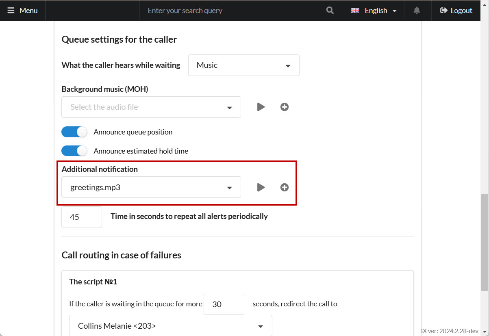

# Callback module

This module is designed to handle missed calls automatically. Whenever a missed call is detected, a callback task is created. As soon as an employee becomes available, they receive a call; once they answer, an attempt is made to connect with the client.

Let's walk through the module's functionality with a few examples:

## Missed Call

A client attempted to contact the company but was unable to reach anyone. This might happen for various reasons, such as:

* The call was disconnected.
* The client hung up before anyone answered.

In response, the module generates a callback task. Once an employee becomes available, they receive the task call.

<figure><figcaption>
Module overview
</figcaption></figure>

An alert sound file can be played for the employee. You can specify this file in the module settings under **Alert "A connection with the client will be made."** After the notification, the system will initiate the client call.

Employees handling missed calls should be added to a shared **Call Queue**. Set the queue number or employee number for handling missed calls in the module settings.

Not every answered call can be considered successful. The module allows you to define a criterion, **The duration of the answered call, which we consider successful.**

If the call is unsuccessful, you can set retry parameters:

* **Delay** – interval between retry attempts
* **Number of call attempts**

Older calls may no longer be relevant, so there is a configurable “expiry time” for missed calls. Calls and tasks older than the set **The number of seconds to analyze missed in the history** will not be processed.

## Callback Request from Client

In cases where a client is tired of waiting and requests a callback, the module can handle it as well. Specify the sound file in **Alert "The request for a callback has been accepted"**

Once the client presses **1**, a callback task is created, and the client hears the confirmation notification. The **Press 1 to request a callback** feature is available in queues listed under **Queues for callback**.

You can also configure additional notifications in the **Advanced** settings for individual queues.


The **Ad phrase or additional notification** setting for queues only works when all employees are **busy**.


<figure><figcaption>
Additional settings in the queue section
</figcaption></figure>

This feature can, for instance, prompt the client to press "1" to initiate a callback request.
