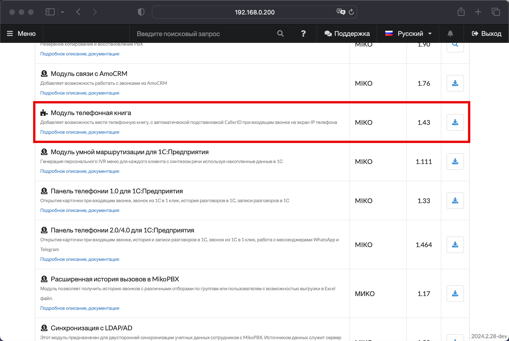
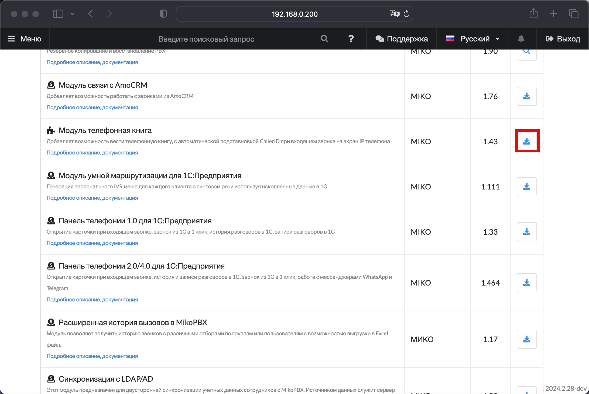
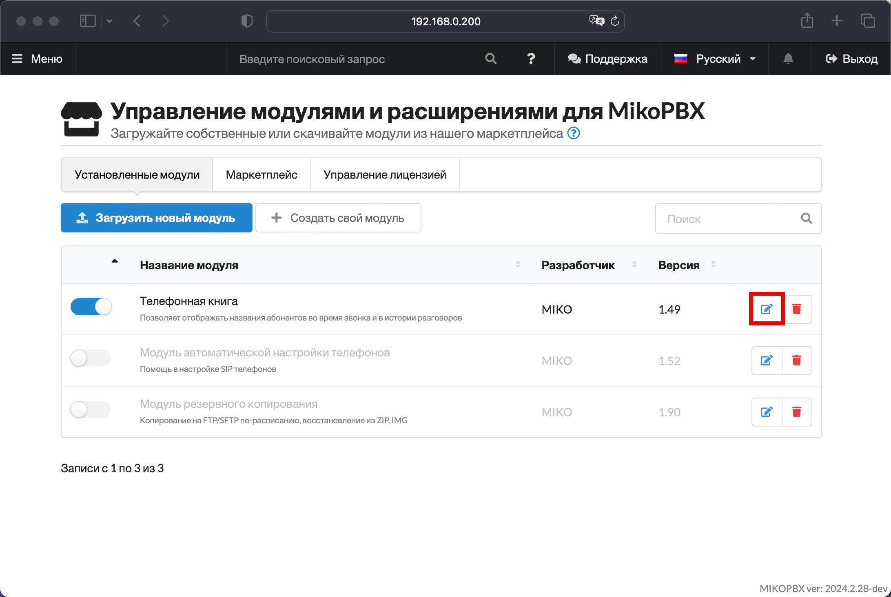
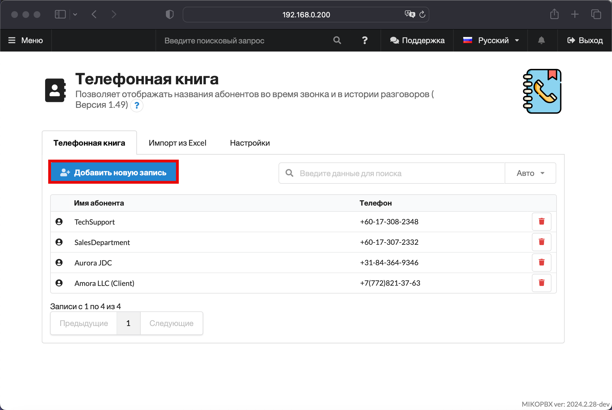
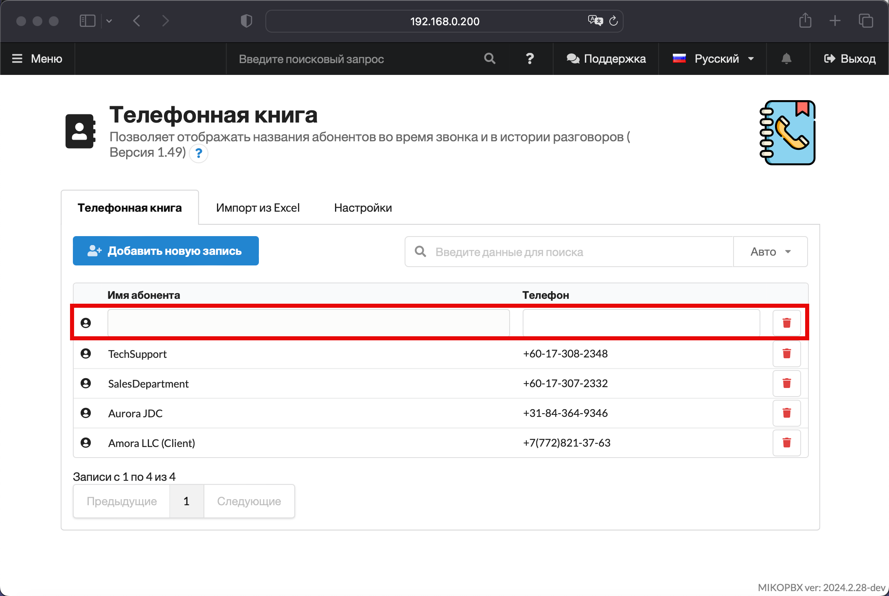
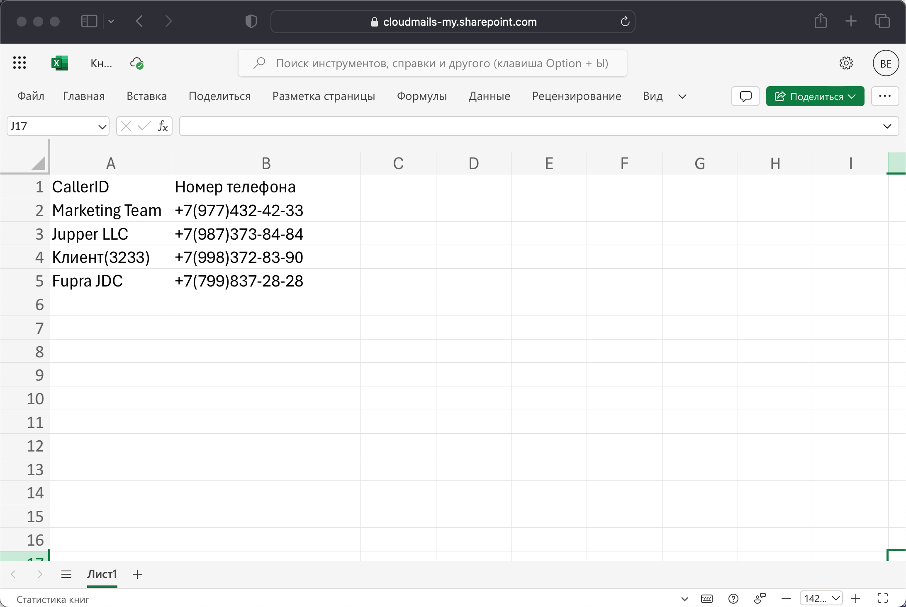
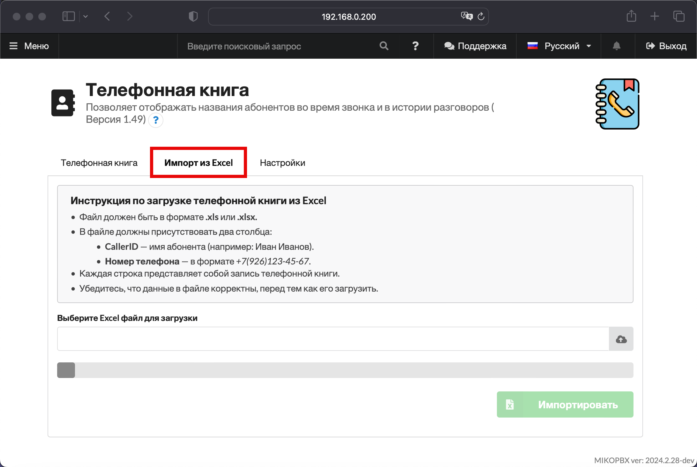
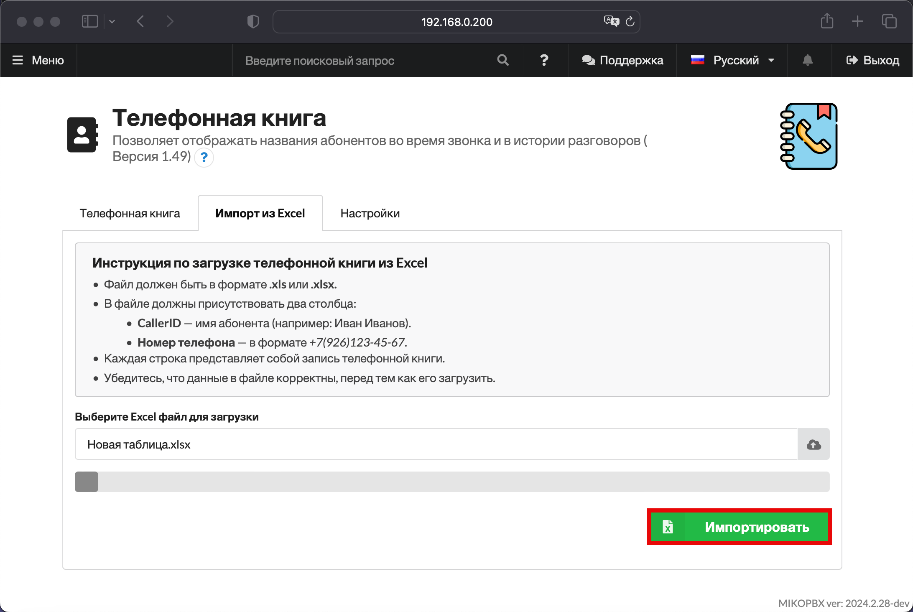

# Телефонная книга


In develop stage


Модуль **«Телефонная книга»** в MikoPBX — удобный инструмент для организации и управления контактами внутри системы. Он позволяет хранить контактные данные всех необходимых абонентов в одном месте, обеспечивая легкий доступ к информации для пользователей и сотрудников.

## Подключение модуля

1. Перейдите в раздел "**Модули"** -> "**Маркетплейс модулей"**
2. Вкладка "**Маркетплейс**". Используя строку поиска или вручную найдите модуль "Т**елефонная книга**"

<figure><figcaption>
Модуль "<strong>Телефонная книга</strong>" в Маркетплейсе
</figcaption></figure>

3. Произведите установку модуля:

<figure><figcaption>
Установка модуля
</figcaption></figure>

## Работа с модулем

### Добавление записей вручную

Для работы с модулем, перейдите в его настройки во вкладке "Установленные модули" :

<figure><figcaption>
Переход в настройки модуля
</figcaption></figure>

В интерфейсе модуля вы можете добавить новый контакт, используя кнопку "Добавить новую запись"

<figure><figcaption>
"Добавить новую запись"
</figcaption></figure>

Далее вы можете ввести имя абонента, а так же телефон, привязанный к нему.

<figure><figcaption>
Новая запись в телефонной книге
</figcaption></figure>

### Импорт из Excel

Существует опция импорта (загрузки) записей из Excel. Для этого вам необходимо соблюдать формат по следующим пунктам:

1. Файл должен быть в формате **.xls** или **.xlsx.**
2. В файле должны присутствовать два столбца:

* **CallerID** — имя абонента (например: Иван Иванов).
* **Номер телефона** — в формате _+7(926)123-45-67_.

3. Каждая строка представляет собой запись телефонной книги.

Убедитесь, что данные в файле корректны, перед тем как его загрузить.

<figure><figcaption>
Пример таблицы в Excel
</figcaption></figure>

Далее, в интерфейсе модуля, перейдите в раздел "**Импорт из Excel**":

<figure><figcaption>
Раздел "Импорт из Excel"
</figcaption></figure>

Выберите Excel файл для загрузки данных.

Нажмите "**Импортировать**".

<figure><figcaption></figcaption></figure>

