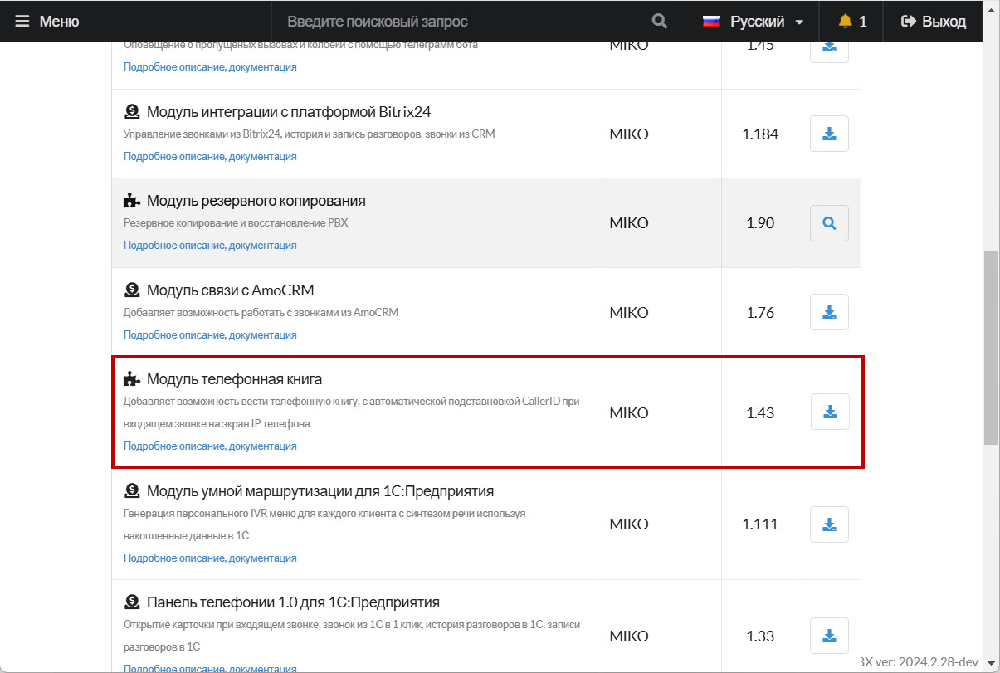
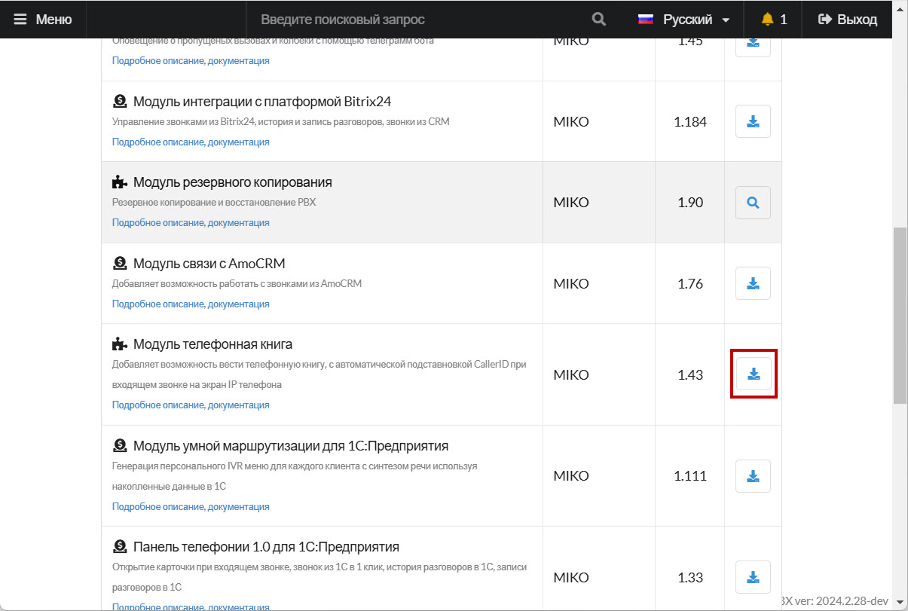
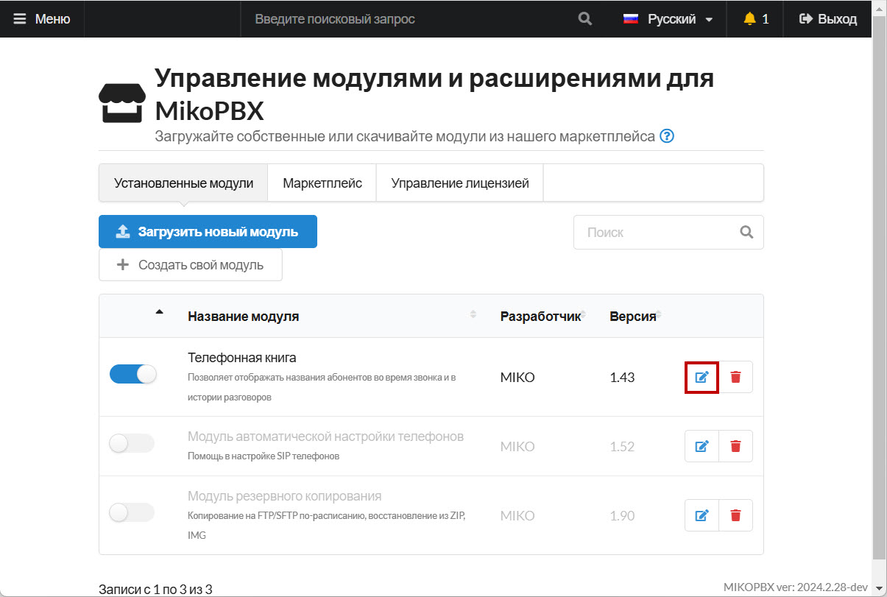
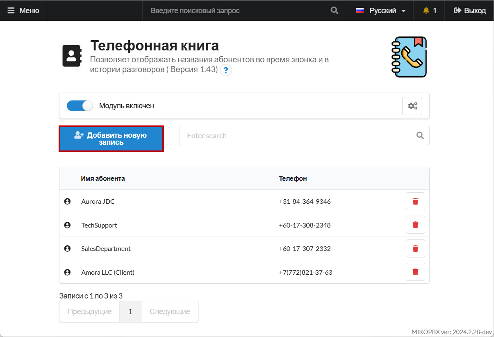

# Телефонная книга

Модуль **«Телефонная книга»** в MikoPBX — удобный инструмент для организации и управления контактами внутри системы. Он позволяет хранить контактные данные всех необходимых абонентов в одном месте, обеспечивая легкий доступ к информации для пользователей и сотрудников.

## Подключение модуля

1. Перейдите в раздел "**Модули"** -> "**Маркетплейс модулей"**
2. Вкладка "**Маркетплейс**". Используя строку поиска или вручную найдите модуль "Т**елефонная книга**"

<figure><figcaption>
Модуль "<strong>Телефонная книга</strong>" в Маркетплейсе
</figcaption></figure>

3. Произведите установку модуля:

<figure><figcaption>
Установка модуля
</figcaption></figure>

## Работа с модулем

Для работы с модулем, перейдите в его настройки во вкладке "Установленные модули" :

<figure><figcaption>
Переход в настройки модуля
</figcaption></figure>

В интерфейсе модуля вы можете добавить новый контакт, используя кнопку "Добавить новую запись"

<figure><figcaption>
"Добавить новую запись"
</figcaption></figure>
