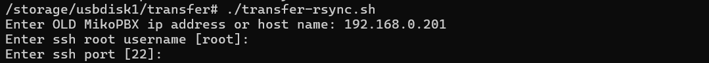

# Перенос с помощью rsync (isnt working now)

В данной статье будет разобран вариант переноса данных на новый хост с помощью rsync. Данный вариант - перенос с использованием генерируемого ключа для ssh-авторизации (предпочтительный). Этот способ является самым надёжным из представленных в разделе, поэтому и является рекомендуемым к использованию.

## Создание файла для хранения скрипта и наполнение его содержимым <a href="#variant_3" id="variant_3"></a>

1. Для начала нам необходимо установить SSH соединение с **новой** MikoPBX. Прочитать как сделать это, можно в [этой статье](../../faq/troubleshooting/connecting-to-a-pbx-using-ssh/).&#x20;

<figure><figcaption><p>Успешное SSH соединение с новой MikoPBX</p></figcaption></figure>

2. Далее переходим в консоль (**\[9] Console**). Первым делом необходимо создать директорию для хранения файла со скриптом. Используйте следующую команду:

```
mkdir -p /storage/usbdisk1/transfer
```

3. Перейдите в созданную директорию:

```
cd /storage/usbdisk1/transfer
```

4. Создадим файл "**transfer-rsync.sh**"  для хранения скрипта:

```
touch transfer-rsync.sh
```

<figure><figcaption><p>Выполнение команд для создания файла</p></figcaption></figure>

5. Далее необходимо заполнить файл содержимым (скриптом). Ознакомиться с ним Вы можете[ по ссылке](https://gist.github.com/excla1mmm/c9891306b459cac0c7ea3c785ab0936e).

```php
curl -o /storage/usbdisk1/transfer/transfer-rsync.sh https://gist.githubusercontent.com/excla1mmm/c9891306b459cac0c7ea3c785ab0936e/raw/ec57ab60ee48112b4a16635e7b47955e5a044513/transfer-rsync.sh
```

## Запуск и работа со скриптом

1. На данном этапе необходимо сделать файл исполняемым. Для этого используйте следующую команду:

```
chmod +x transfer-rsync.sh
```

2. Запустите скрипт, используя команду:

```
./transfer-rsync.sh
```

3. Для начала будет предложено ввести необходимые данные о вашей старой станции MikoPBX:

* IP-адрес вашей старой станции
* Имя для ssh-авторизации
* Порт для ssh-авторизации

<figure><figcaption><p>Ввод необходимых данных</p></figcaption></figure>

4. Далее будет предложено сгенерировать новый ключ. В случае, если ранее вы этого не делали, введите "y" для подтверждения. Если ранее вы уже генерировали ключ для доступа ко второй MikoPBX - введите "n":

<figure><figcaption><p>Генерация нового ключа</p></figcaption></figure>

5. Будет создан новый ключ. Вам необходимо скопировать его и вставить в web-Интерфейсе старой MikoPBX. Сделать это нужно в разделе "**Общие настройки**" -> "**SSH**" -> Поле "**SSH Authorized keys**"

<figure><figcaption><p>Сгенерированный ключ ssh</p></figcaption></figure>

<figure><figcaption><p>Вставленный ключ</p></figcaption></figure>

6. После того, как вы сохранили ключ на старой MikoPBX, подождите несколько секунд и нажмите любую клавишу для продолжения выполнения скрипта.

Будет произведен перенос всех данных на новый хост. Это может занять некоторое время.


После переноса обязательно проверяйте целостность всех данных, перед тем, как сбрасывать старую MikoPBX!


<figure><figcaption><p>Успешный перенос</p></figcaption></figure>
