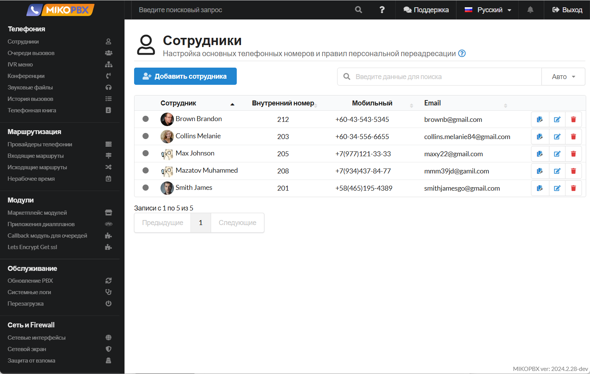

# Руководство по MikoPBX

## Предисловие&#x20;

Добро пожаловать на ресурс документации по MikoPBX! Здесь вы сможете найти пошаговые инструкции, связанные с взаимодействием с АТС MikoPBX. Для вашего удобства, они собраны в разделы - прямо как в WEB-интерфейсе, поэтому ориентироваться в документации очень легко.

Благодарим вас за выбор **MikoPBX**! :heart:

## Что такое MikoPBX?

**MikoPBX -** это **бесплатный** сервер телефонии с операционной системой и простым, удобным веб-интерфейсом. Она работает практически с любой телефонной технологией в мире.

<figure><figcaption>
Интерфейс MikoPBX
</figcaption></figure>

MikoPBX — это полностью модульный интерфейс для Asterisk, написанный на PHP и Javascript. Это значит, что вы можете создать любой модуль, который вам нужен, и бесплатно распространять его своим клиентам, чтобы они могли воспользоваться полезными функциями [Asterisk](http://www.asterisk.org/). Помимо этого, MikoPBX имеет очень низкие требования к аппаратному обеспечению ПК:

| Одновременные звонки |  Минимально рекомендуемая конфигурация   |
| :------------------: | :--------------------------------------: |
|        5 - 10        |         1 GHz x86-64, 512 MB RAM         |
|        До 25         |          3 GHz x86-64, 1 GB RAM          |
|       Более 25       | 2 CPUs 3 GHz x86-64, 2 GB RAM или больше |

## С чего начать?

Для начала вам следует установить MikoPBX любым удобным для вас способом. Ниже находятся опции установки. Нажав на их название - вы можете перейти к подробным профильным статьям:

* Установка [на отдельный компьютер](../../setup/bare-metal.md).
* Установка [в виртуальную машину](../../setup/hypervisor/).
* Установка [с помощью облачных сервисов](../../setup/cloud/).
* Установка в [Docker контейнере](../../setup/docker/).

После установки вы можете перейти к изучению вашей станции. В этом вам поможет дальнейшая документация "**Руководство пользователя**", которая подробно рассказывает про конкретные разделы:&#x20;

* [Телефония](../../manual/telephony/).
* [Маршрутизация](../../manual/routing/).
* [Модули](../../manual/modules/).
* [Обслуживание](../../manual/maintenance/).
* [Сеть и Firewall](../../manual/connectivity/).
* [Система](../../manual/system/).

За дополнительной помощью по "быстрому старту", вы можете обратиться к [данной статье](bystroe-nachalo-raboty.md).

## Модули

В случае, если вы разобрались с базовой настройкой и эксплуатацией MikoPBX, Вы можете расширить ее функционал с помощью модулей.

Они позволяют добавить дополнительные функции вашей системы. Разобраться в них подробнее вы можете по шагам:

1. [Регистрация в Маркетплейсе MikoPBX](../../manual/modules/licensing.md) - здесь подробно описан процесс регистрации и его особенности.
2. [Управление модулями](../../manual/modules/pbx-extension-modules/) - здесь подробно описан процесс установки и управления модулями.
3. [Документация по конкретным модулям](../../modules/miko/) - в этом разделе вы найдете подробное описание каждого модуля, а так же шаги по его настройки и использованию.

## Раздел FAQ

В данной секции Вы можете найти ответы на интересующие вас вопросы, а так же решения, которые помогут вам расширить функционал базовых функций. Данная секция, так же, как и основная разделена на разделы для удобства поиска интересующих вас тем.

Если у вас возник вопрос, который не разобран в данном разделе - Вы можете обратиться за помощью в [Telegram Community](https://t.me/mikopbx), где пользователи MikoPBX помогают друг другу решить вопросы и потребности, связанные с АТС.
