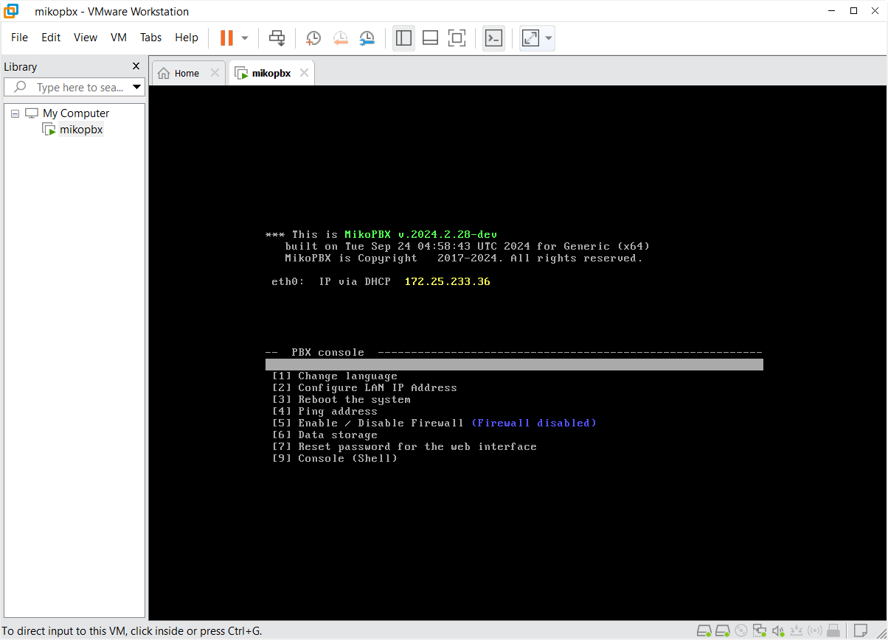
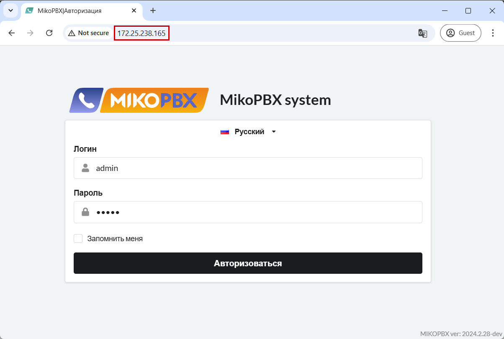

# Быстрое начало работы

Данная инструкция подробно расскажет о пути начала работы с MikoPBX и поможет вам быстро разобраться с настройкой системы. Следуйте инструкциям **шаг-за-шагом** в том порядке, в котором они представлены для быстрой и успешной настройки системы.

## Установка MikoPBX

**MikoPBX** - полноценная **операционная система** для вашего оборудования, **не является отдельной программой**. Поставляется в виде образа (файл \*.iso, \*.img, \*.raw).

Она поддерживает многие способы установки:

* Установка [на отдельный компьютер](https://docs.mikopbx.com/mikopbx/setup/bare-metal).
* Установка [в виртуальную машину](https://docs.mikopbx.com/mikopbx/setup/hypervisor).
* Установка [с помощью облачных сервисов](https://docs.mikopbx.com/mikopbx/setup/cloud).
* Установка в [Docker контейнере](https://docs.mikopbx.com/mikopbx/setup/docker).

Перейдите по ссылке к интересующему Вас способу установки и произведите её по данным инструкциям.

## Первый вход в веб-интерфейс

После установки Вам необходимо перейти в web-интерфейс MikoPBX для дальнейшей настройки системы. Для того, чтобы это сделать - найдите IP-адрес станции в консоли MikoPBX:

<figure><figcaption>
Пример консоли MikoPBX
</figcaption></figure>

В данном примере - IP-адрес **172.25.233.36**. Для перехода в web-интерфейс введите этот IP в адресную строку вашего браузера:

<figure><figcaption>
Окно входа в MikoPBX
</figcaption></figure>


Если в логах Вам не даны логин и пароль, используйте данные по-умолчанию:

Username: admin

Password: admin


После первой авторизации, система попросит Вас поменять пароль.

## Настройки внутри web-интерфейса:

### Настройки сети и сетевого экрана

Для стабильной работы АТС необходимо настроить **сеть** через раздел **Сеть и Firewall** → **Сетевые интерфейсы**. Ознакомится с подробной инструкцией по данным настройкам можно [здесь](../../manual/connectivity/network.md).

В MikoPBX все локальные подсети возможно описать в разделе **Сеть и Firewall** → **Сетевой экран**. Сетевой экран предназначен для ограничения доступа к станции по типу трафика и подсетям. Выполните настройку по [инструкции](../../manual/connectivity/firewall.md).

***

### Настройка защиты от взлома (Fail2Ban)

Fail2ban блокирует IP адреса с нестандартной активностью, он способен снизить скорость неудачных попыток аутентификации, позволяет защитить Вашу АТС от взлома. Инструкцию, которая поможет в настройке можно найти [здесь](../../manual/connectivity/fail2-ban.md).

***

### Добавление и настройка учетных записей сотрудников

После окончания первоначальной настройки АТС, Вы можете перейти к созданию учетных записей ваших сотрудников. В этом вам поможет [инструкция](../../manual/telephony/extensions.md).

***

### Подключение провайдеров

После добавления сотрудников, Вам необходимо подключить провайдеров к вашей станции. Инструкцию про этот раздел вы можете найти [здесь](../../manual/routing/providers.md). Инструкции с примерами настройки реальных провайдеров вы можете найти [здесь](../../faq/providers/).

***

### Настройка входящей и исходящей маршрутизации

На данном этапе необходимо задать правила маршрутизации для входящих и исходящих вызовов: как будут обрабатываться звонки, идущие через определенного провайдера:

* [Маршрутизация входящих вызовов](../../manual/routing/incoming-routing.md)
* [Маршрутизация исходящих вызовов](../../manual/routing/outbound-routing.md)

Для создания правил маршрутизации Вам так же могут понадобиться следующие функции:

* [Очереди вызовов](../../manual/telephony/call-queues.md)
* [IVR-меню](../../manual/telephony/ivr-menu.md)
* [Конференции](../../manual/telephony/conference-rooms.md)

***

### Маркетплейс и модули

Маркетплейс позволяет расширить стандартный функционал системы с помощью модулей:

* Подробнее про Модули в MikoPBX Вы можете прочитать в [этой статье](../../manual/modules/).
* Про регистрацию в Маркетплейсе MikoPBX Вы можете прочитать в [этой статье](../../manual/modules/licensing.md).


На этом основная настройка MikoPBX завершена! Для более глубокого изучения возможностей MikoPBX рекомендуем обратиться к общей документации.

