# DigitalOcean (В следующем релизе)

В данной инструкции мы пошагово произведем установку MikoPBX с помощью облачной платформы DigitalOcean.

&#x20;Перед началом Вам необходимо скопировать ссылку на актуальный образ MikoPBX с расширением .raw. Сделать это можно на [github MikoPBX](https://github.com/mikopbx/core/releases).

## Загрузка образа в DigitalOcean

1. Перейдите в "**Manage**" -> "**Backups & Snapshots**"

<figure>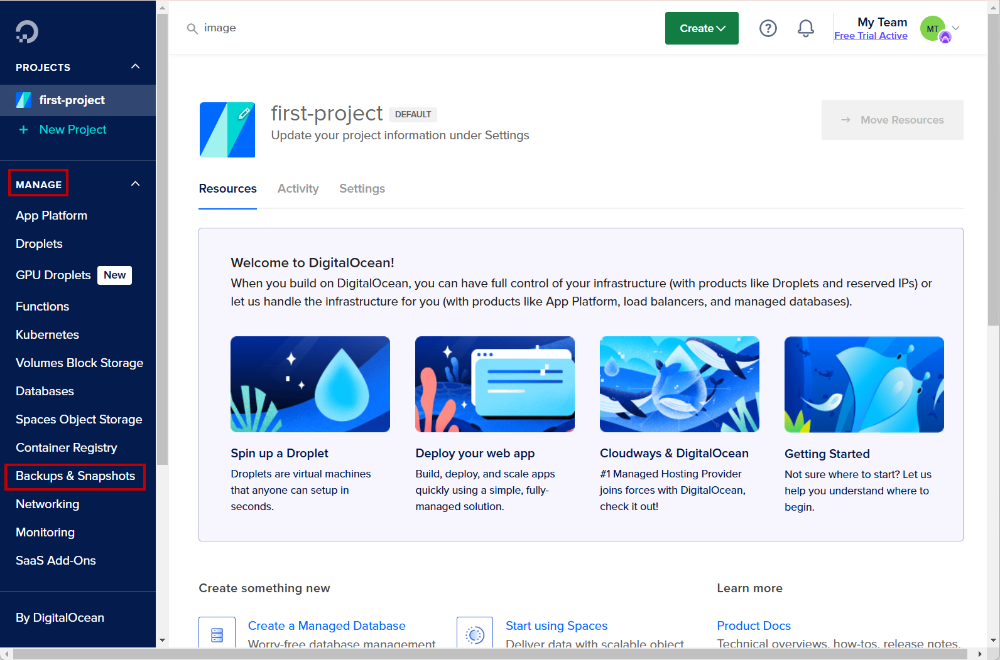<figcaption>
Раздел "<strong>Backups &#x26; Snapshots"</strong>
</figcaption></figure>

2. Перейдите в "**Custom Images**" -> "**Import via URL**":

<figure>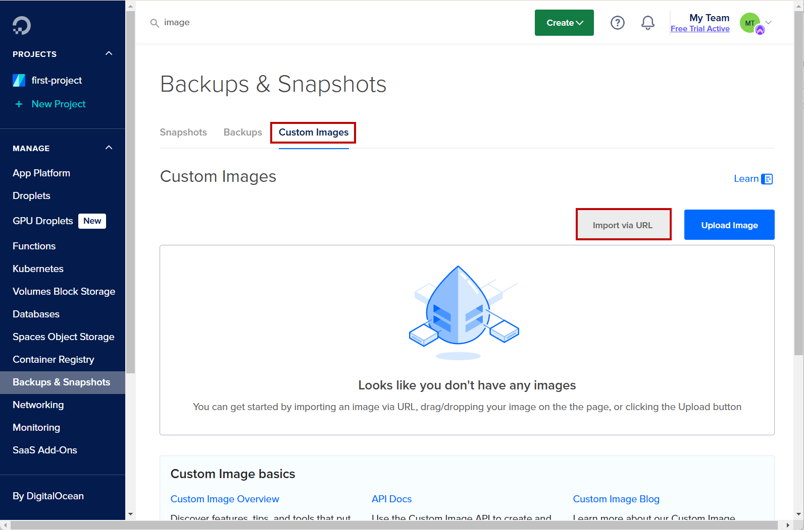<figcaption>
"Import via URL" 
</figcaption></figure>

3. Вставьте ссылку на файл образа диска с расширением .raw, скопированную ранее.&#x20;
4. Введите имя для образа, выберите регион для его загрузки (должен совпадать с будущим регионом виртуальной машины). В качестве операционной системы образа выберите "**Unknown**"

Нажмите "**Upload image**"

<figure>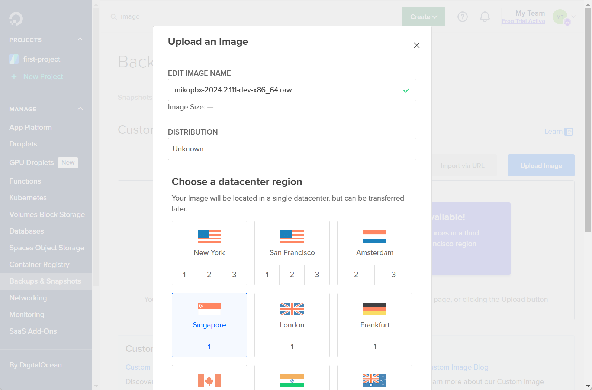<figcaption>
Параметры образа
</figcaption></figure>

Дождитесь загрузки образа.

## Создание виртуальной машины в облаке

1. Перейдите на главную страницу DigitalOcean.

<figure>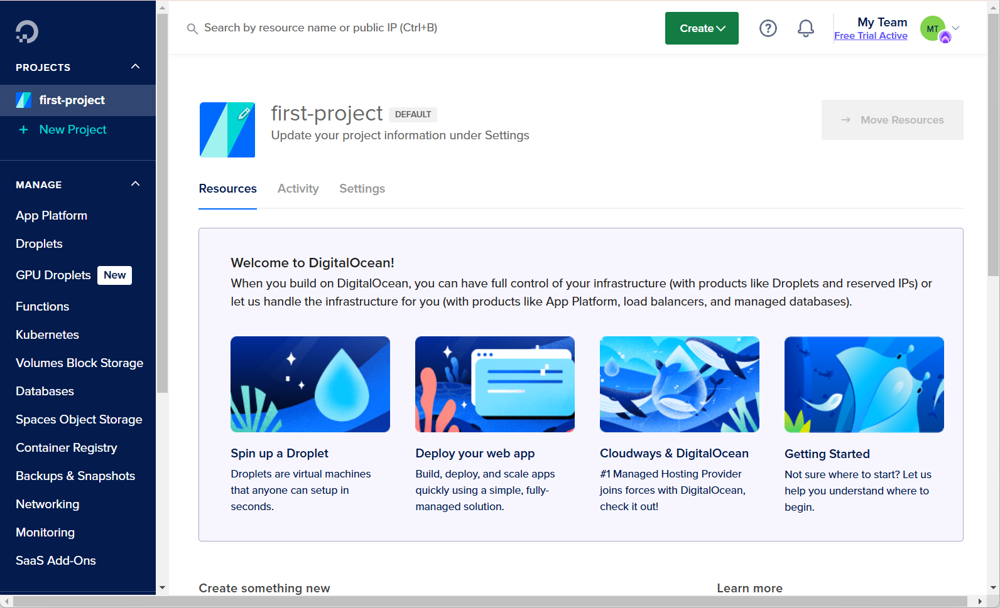<figcaption>
Главная страница DigitalOcean
</figcaption></figure>

2. Для перехода к создаю виртуальной машины, перейдите в "**Create**" -> "**Droplets**":

<figure>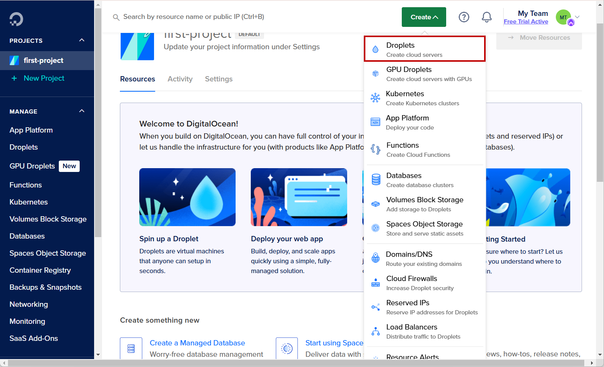<figcaption>
Создание нового "Droplet"
</figcaption></figure>

3. Выберите регион и датацентр для Вашей виртуальной машины.

<figure>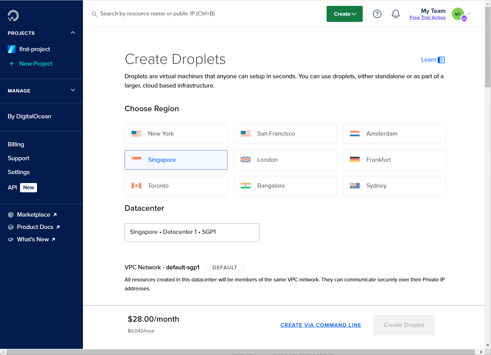<figcaption>
Параметры ВМ #1
</figcaption></figure>

4. Далее выберите ранее загруженный образ и конфигурацию для вашей виртуальной машины:

<figure>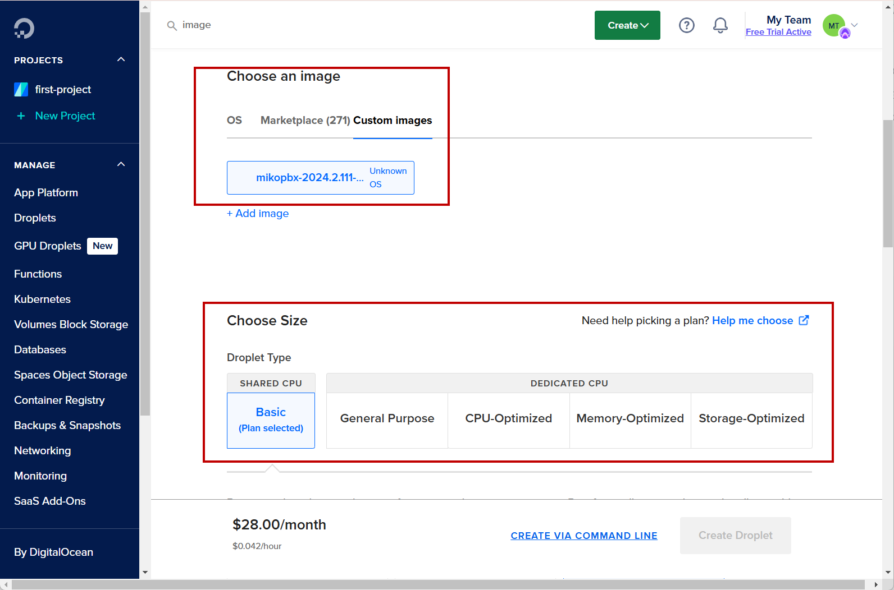<figcaption>
Параметры ВМ #2
</figcaption></figure>

5. Перейдите во вкладку "Additional Storage". Здесь необходимо добавить второй диск, который будет использоваться для хранения записей разговоров. Для этого нажмите "Add volume" и укажите параметры для нового диска.


Рекомендуемый размер диска для хранения записей разговоров  - от 50ГБ.


<figure>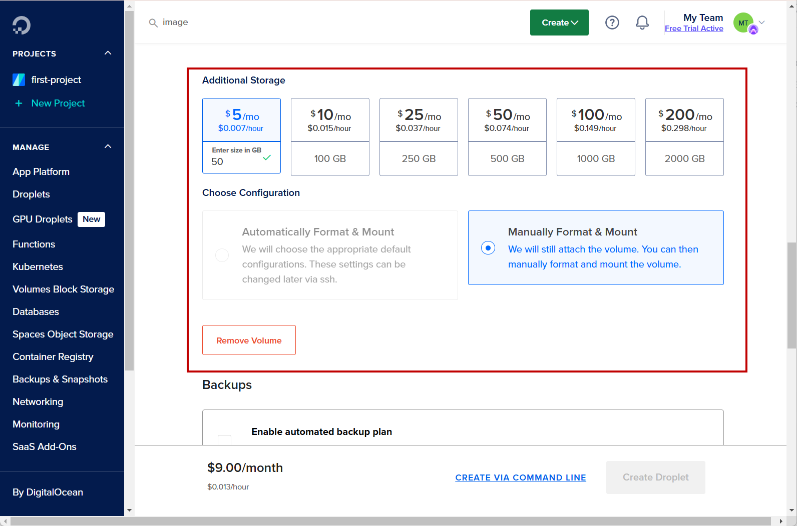<figcaption>
Раздел "Additional Storage"
</figcaption></figure>

6. Перейдите в раздел "**Choose authentication method**". Здесь необходимо выбрать "SSH Key" и добавить связку ключей для SSH подключения. Подробнее прочитать про их создание Вы можете в следующих статьях:

* [WIndows](../../faq/troubleshooting/connecting-to-a-pbx-using-ssh/powershell.md)
* [MacOS/Linux](../../faq/troubleshooting/connecting-to-a-pbx-using-ssh/terminal.md)

<figure>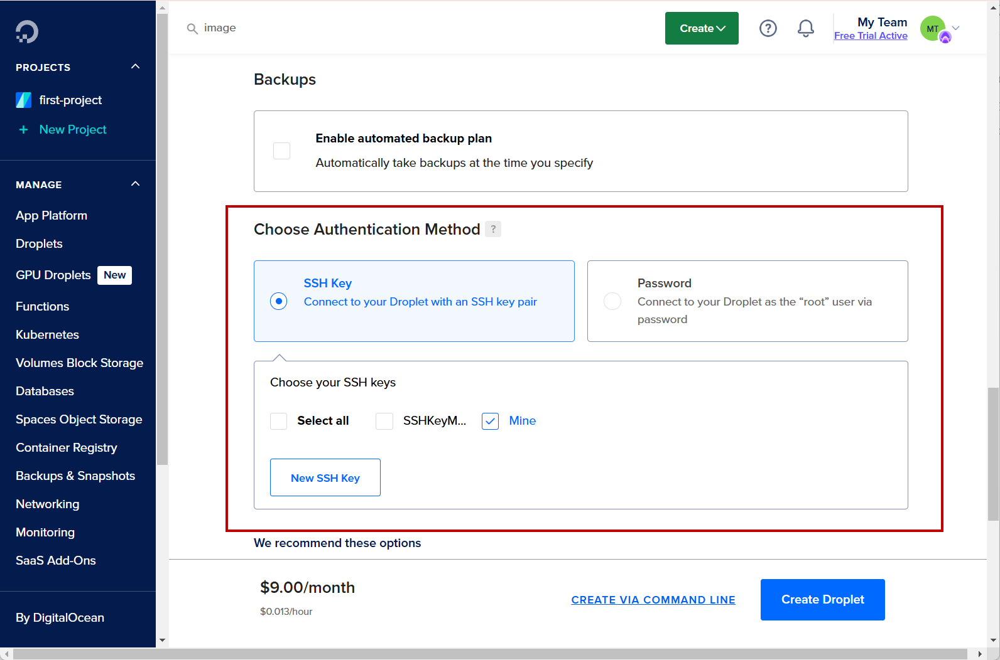<figcaption>
Методы авторизации
</figcaption></figure>

7. Нажмите "Create Droplet"

## Подключение к консоли и первый вход в WEB-Интерфейс

1. Перейдите в меню созданной машины. Дождитесь ее запуска. Далее подключитесь к ней по SSH ([интрукция](../../faq/troubleshooting/connecting-to-a-pbx-using-ssh/)), либо с помощью встроенной консоли в DigitalOcean.


Стандартный логин для авторизации по SSH для ВМ в DigitalOcean - do-user


<figure>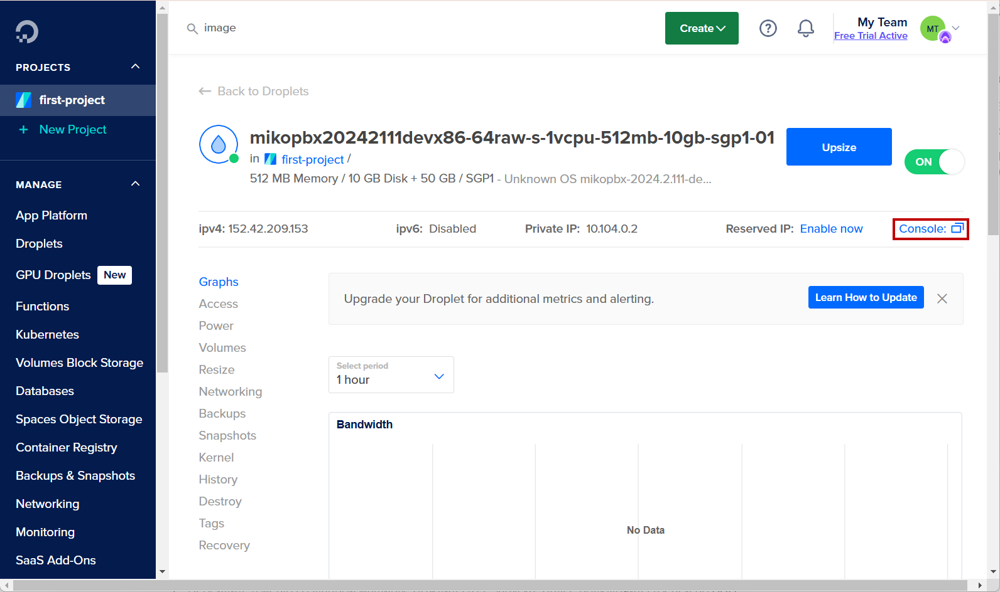<figcaption>
Консоль в Digital Ocean
</figcaption></figure>

2. После загрузки системы, подключитесь через web-интерфейс, используя внешний IP-адрес.

<figure>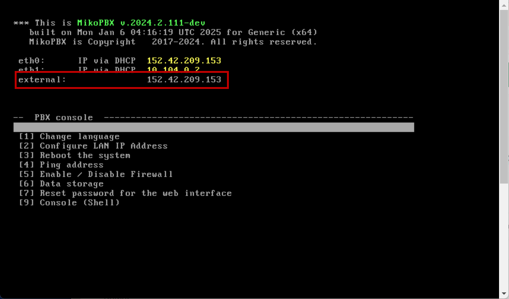<figcaption>
external ip-адрес
</figcaption></figure>

3. После перехода на страницу авторизации в MikoPBX, используйте следующие данные для входа:

* Логин - admin
* Пароль - id Виртуальной машины, найти который Вы можете в адресной строке:

<figure>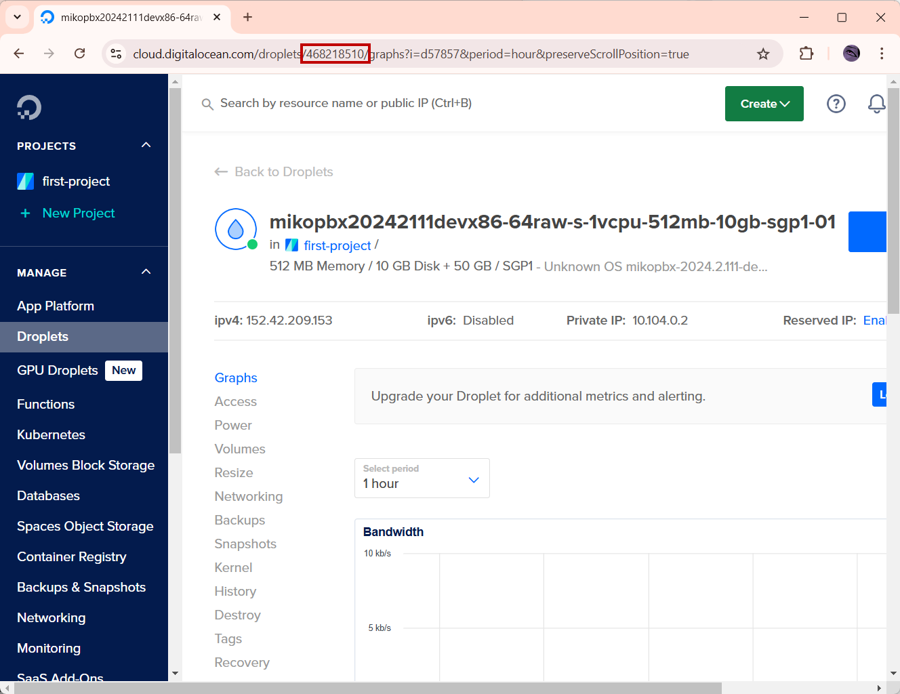<figcaption>
ID виртуальной машины
</figcaption></figure>
