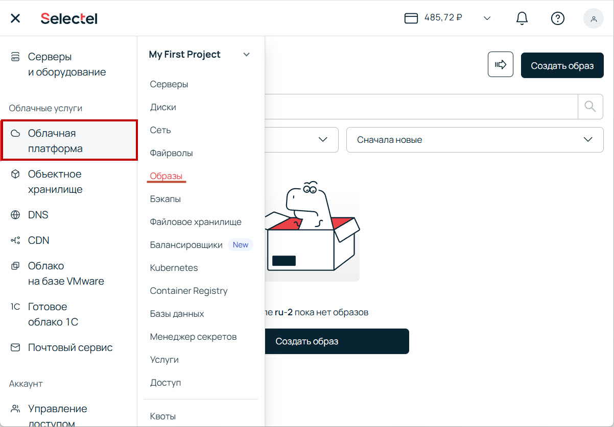
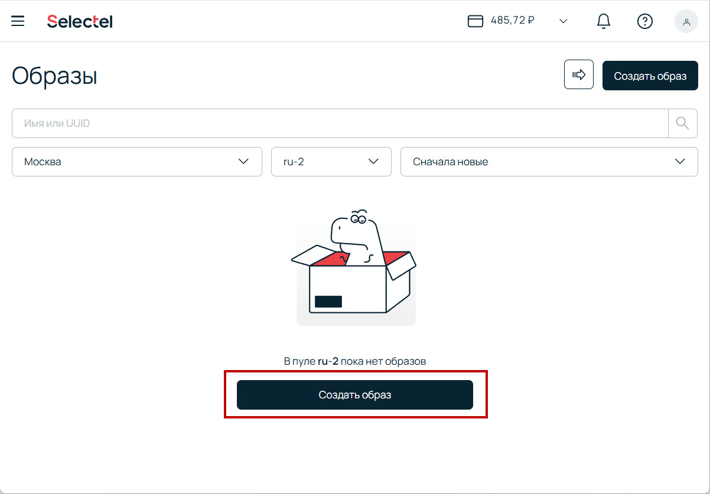
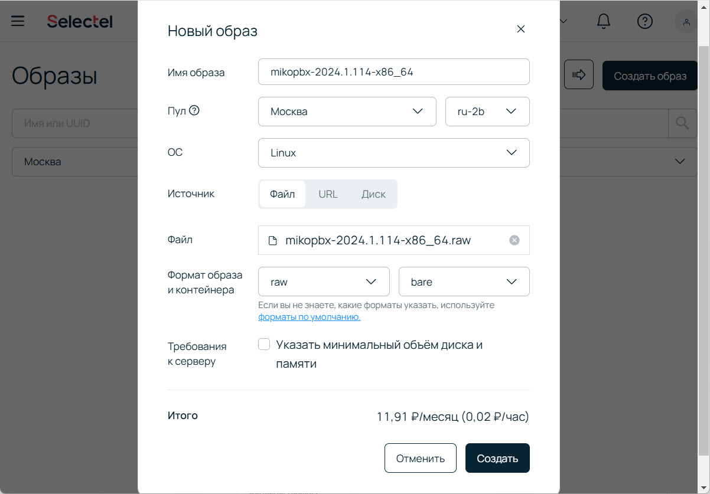
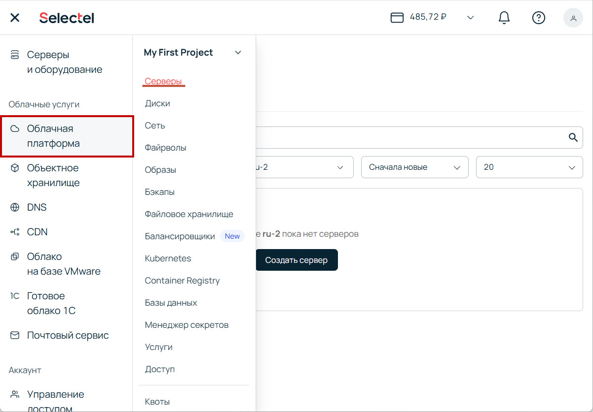
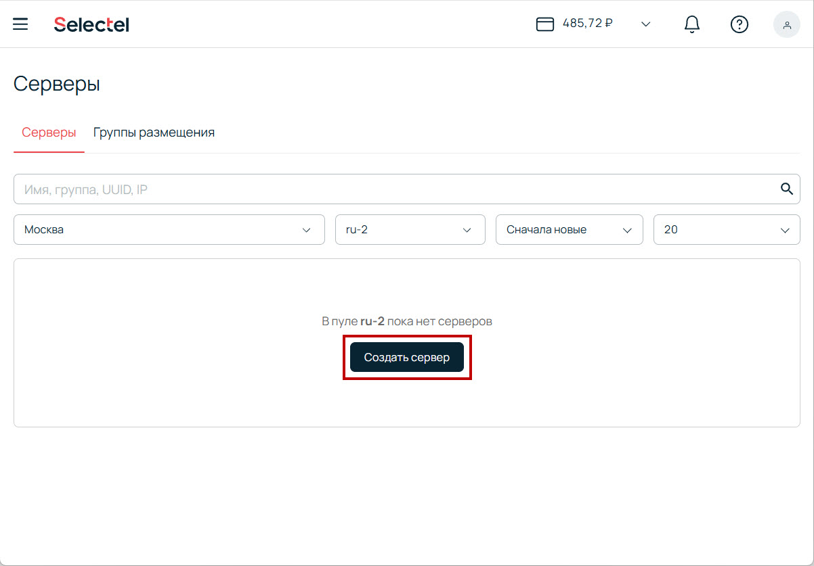
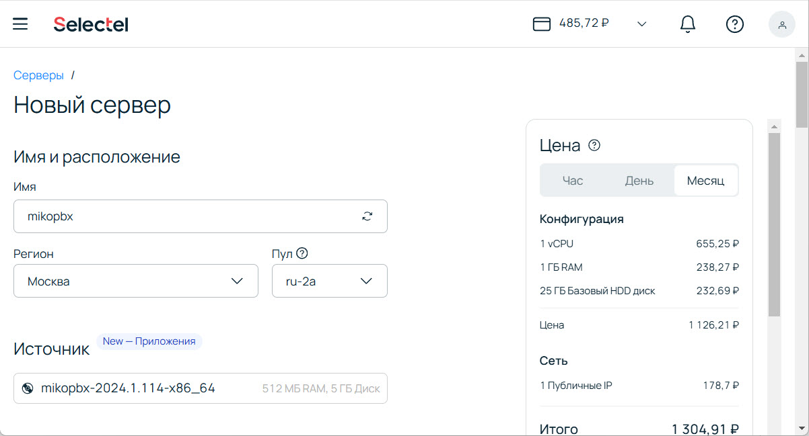

# Selectel

В данной инструкции мы пошагово произведем установку MikoPBX с помощью облачной платформы Selectel.&#x20;

Перед началом вам необходимо скачать актуальный образ MikoPBX с расширением .raw. Сделать это можно по [ссылке](https://github.com/mikopbx/Core/releases).

## Загрузка образа в Selectel

1. Перейдите в раздел **Облачная платформа** -> **Образы**.

<figure><figcaption>
Раздел "Образы"
</figcaption></figure>

2. Нажмите "**Создать образ**".

<figure><figcaption>
Кнопка "Создать образ"
</figcaption></figure>

3. Укажите:

* **Имя образа** - любое желаемое название для вашего образа.
* **ОС** - Linux
* **Источник** - Файл
* **Файл** - выберите раннее загруженный файл с расширением .iso

Все остальное - **по умолчанию**.

Нажмите создать и дождитесь окончания процесса.

<figure><figcaption>
Параметры загружаемого образа диска
</figcaption></figure>

## Создание сервера в Selectel

1. Перейдите в раздел **Облачная платформа** -> **Серверы**

<figure><figcaption>
Раздел "Серверы"
</figcaption></figure>

2. Нажмите "**Создать сервер**":

<figure><figcaption>
"Создать сервер"
</figcaption></figure>

3. В конфигурации вашей ВМ укажите:

* Имя - произвольное название.
* Пул - такой же, как у раннее созданного образа.
* Источник - выберите раннее загруженный образ.
* Конфигурация - желаемое "железо" исходя из ваших потребностей.

<figure><figcaption></figcaption></figure>

* Диски: Здесь вам необходимо указать размер для первого диска (он же - системный диск) - 5Гб (минимально возможный в Selectel). А так
*
