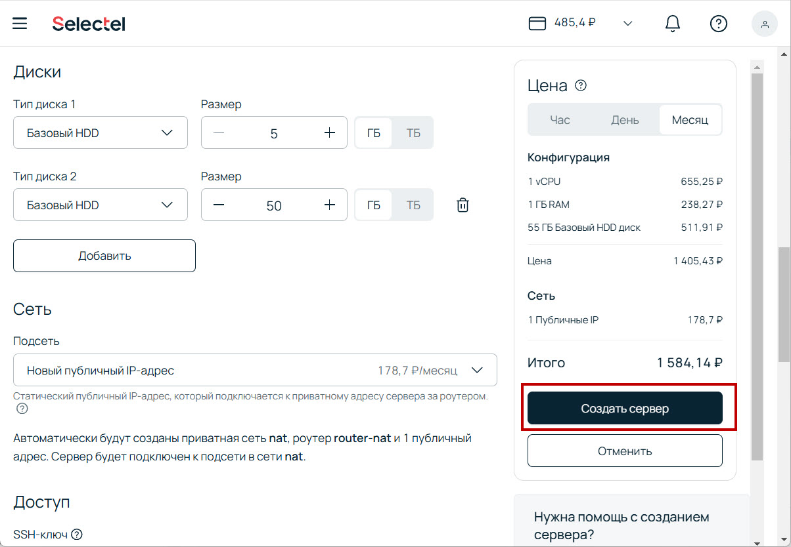
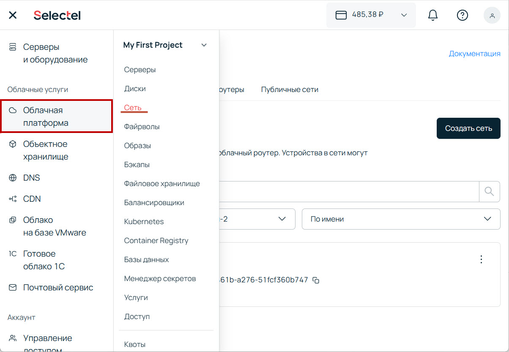
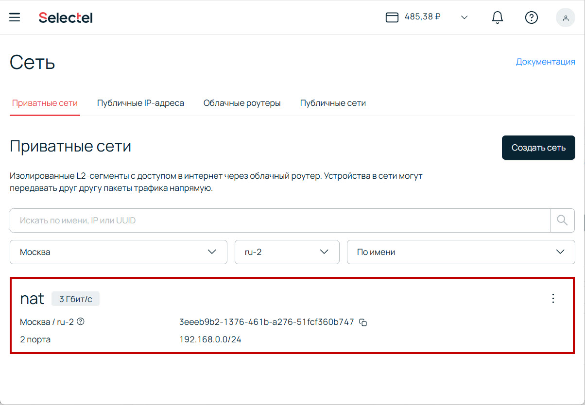
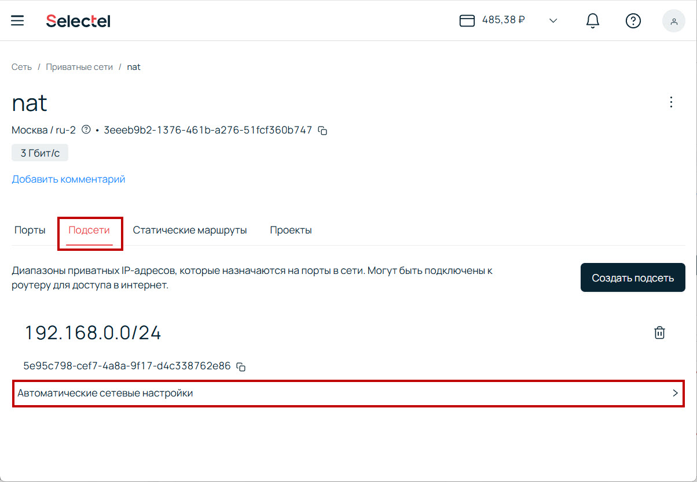
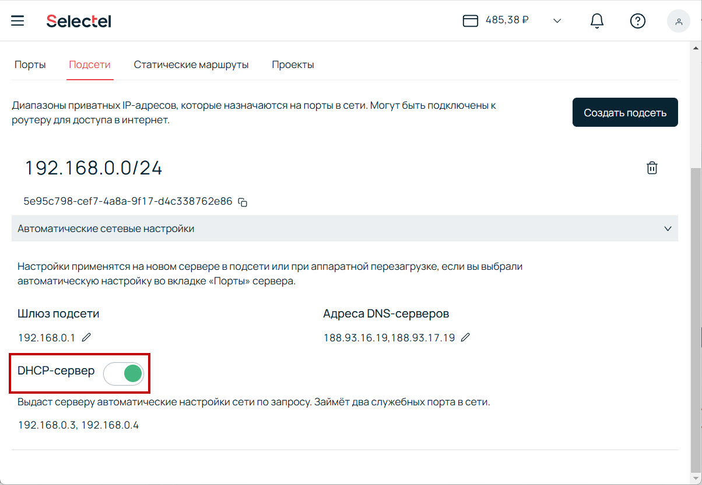
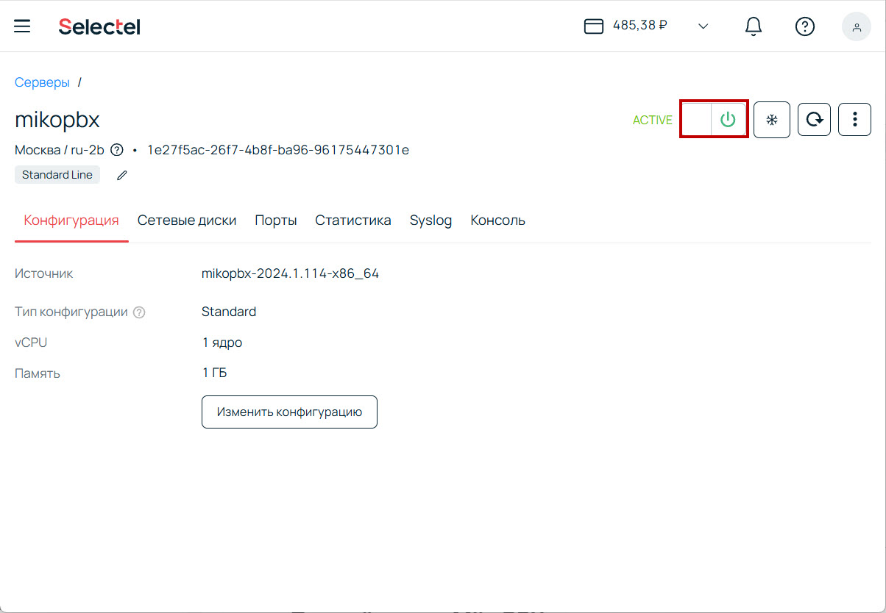
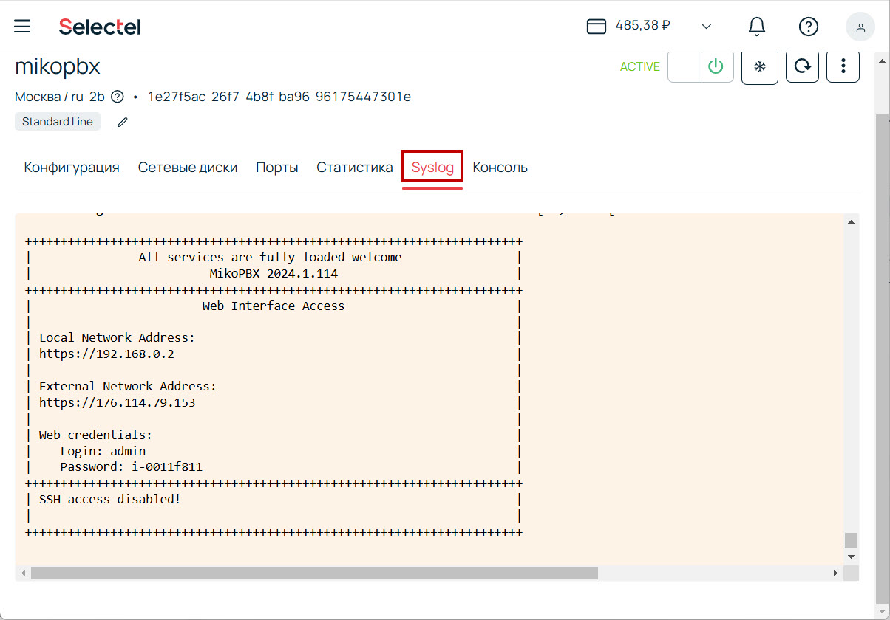
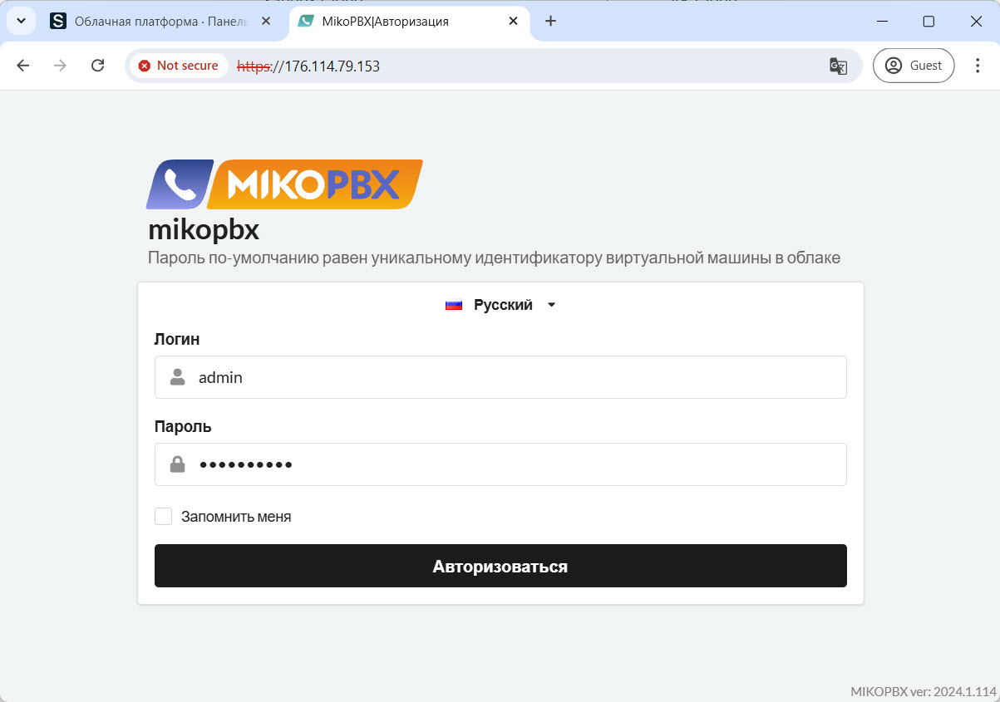

# Selectel

В данной инструкции мы пошагово произведем установку MikoPBX с помощью облачной платформы Selectel.&#x20;

Перед началом вам необходимо скачать актуальный образ MikoPBX с расширением .raw. Сделать это можно по [ссылке](https://github.com/mikopbx/Core/releases).

## Загрузка образа в Selectel

1. Перейдите в раздел **Облачная платформа** -> **Образы**.

<figure><figcaption>
Раздел "Образы"
</figcaption></figure>

2. Нажмите "**Создать образ**".

<figure><figcaption>
Кнопка "Создать образ"
</figcaption></figure>

3. Укажите:

* **Имя образа** - любое желаемое название для вашего образа.
* **ОС** - Linux
* **Источник** - Файл
* **Файл** - выберите раннее загруженный файл с расширением .iso

Все остальное - **по умолчанию**.

Нажмите создать и дождитесь окончания процесса.

<figure><figcaption>
Параметры загружаемого образа диска
</figcaption></figure>

## Создание сервера в Selectel

1. Перейдите в раздел **Облачная платформа** -> **Серверы**

<figure><figcaption>
Раздел "Серверы"
</figcaption></figure>

2. Нажмите "**Создать сервер**":

<figure><figcaption>
"Создать сервер"
</figcaption></figure>

3. В конфигурации вашей ВМ укажите:

* **Имя** - произвольное название.
* **Пул** - такой же, как у раннее созданного образа.
* **Источник** - выберите раннее загруженный образ.
* **Конфигурация** - желаемое "железо" исходя из ваших потребностей.

<figure><figcaption>
Первая секция конфигурации
</figcaption></figure>

* **Диски**: Здесь вам необходимо указать размер для первого диска (он же - системный диск) - **5Гб** (минимально возможный в Selectel). А так же создайте новый диск, используя кнопку "**Добавить**". Укажите размер. Для диска, который используется для записи разговоров - рекомендуемое значение >**50Гб**. Типы дисков - "**Базовый HDD**"
* **Сеть** - "Приватная + 1 публичный IP"

<figure><figcaption>
Вторая секция конфигурации
</figcaption></figure>

3. Нажмите "**Создать сервер**".

<figure><figcaption>
"Создать сервер"
</figcaption></figure>

После создания, сразу остановите запуск сервера.

## Включение DHCP

1. Перейдите в раздел **Облачная платформа** -> **Сеть**.

<figure><figcaption>
Раздел "Сеть"
</figcaption></figure>

2. Перейдите в конфигурацию сети "Nat":

<figure><figcaption>
Сеть "Nat"
</figcaption></figure>

3. Перейдите в раздел **Подсети** -> **Автоматические сетевые настройки**.

<figure><figcaption>
Автоматические сетевые настройк
</figcaption></figure>

4. Включите переключатель "DHCP-сервер".

<figure><figcaption>
"DHCP-сервер"
</figcaption></figure>

## Первый запуск MikoPBX

1. Вернитесь к разделу **Облачная платформа** -> **Серверы.** Далее - в созданный сервер**.**
2. Включите сервер:

<figure><figcaption>
Элемент переключения состояния сервера
</figcaption></figure>

3. Перейдите в раздел "Syslog":

<figure><figcaption>
Раздел "Syslog"
</figcaption></figure>

Произведите подключение по:

External IP Address - внешний IP-адрес вашей MikoPBX. Скопируйте и вставьте его в адресную строку.

Web credentials - данные для входа в WEB-интерфейс. Введите логин и пароль.

<figure><figcaption></figcaption></figure>
