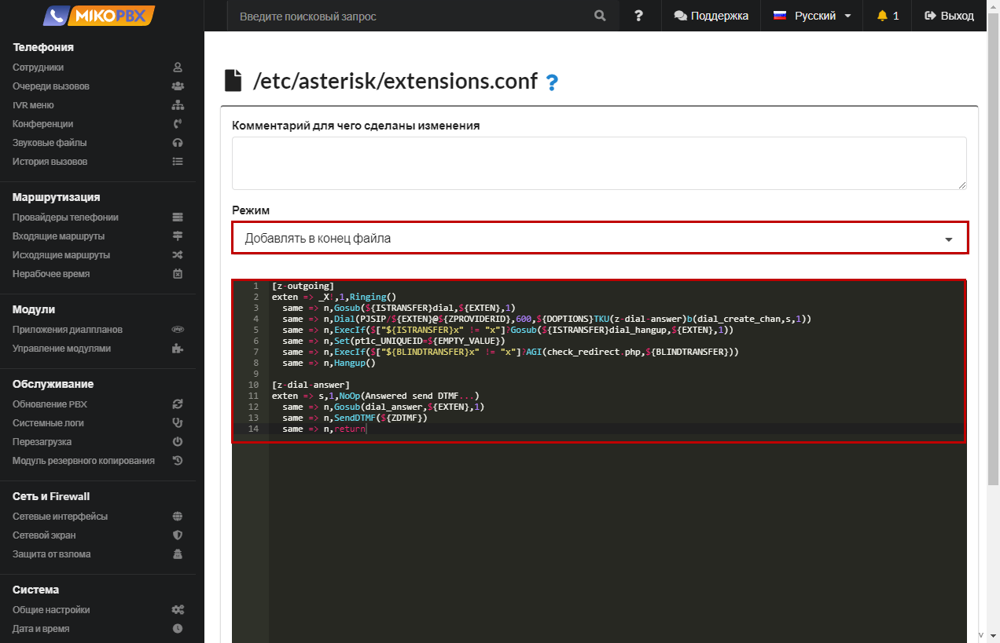
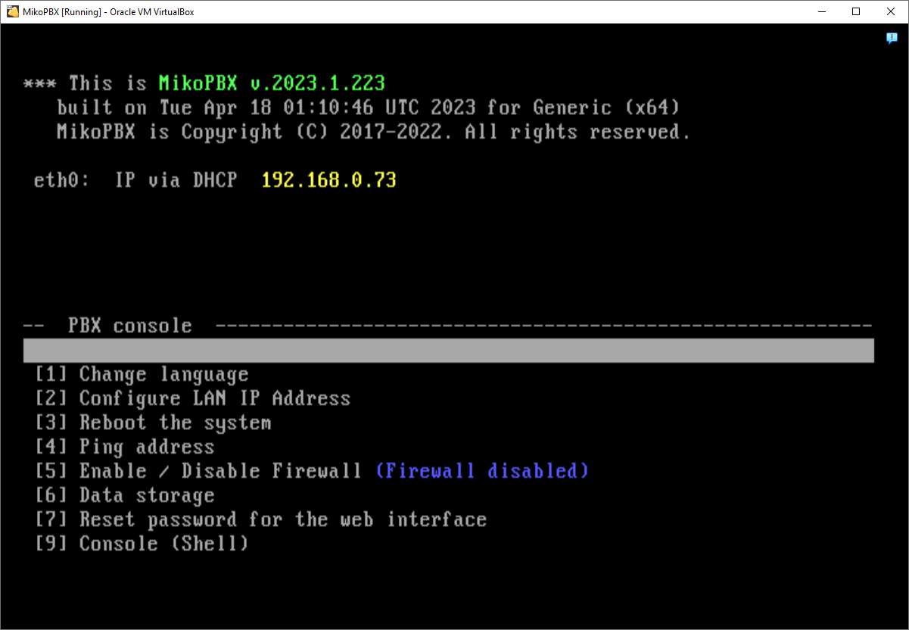

# VirtualBOX

## Создание виртуальной машины 

1\. Скачайте программу **VirtualBox** по [ссылке](https://www.virtualbox.org/wiki/Downloads) и установите ее.

2\. Создайте новую виртуальную машину.

.png>)

3\. Укажите **Имя** и **Папку машины**<mark style="color:green;">.</mark>

**Тип** - <mark style="color:green;">Linux.</mark>

**Версия -** <mark style="color:green;">Other Linux (64Bit).</mark>

Нажмите **Далее.**

4. Укажите размер основной памяти - **1024 МБ,** а так же количество процессоров **- 2**

&#x20;  Нажмите **Далее.**

.png>)

5\. Выберите **Создать новый виртуальный жесткий диск**. Введите размер диска **700 МБ**, а так же поставьте галочку у пункта **"Выделить место в полном размере"**

&#x20;Нажмите **Создать**.

.png>)

6\. Подтвердите создание виртуальной машины: нажмите кнопку **Готово**.

<figure><figcaption></figcaption></figure>

## Настройка виртуальной машины 

1\. Перейдите к настройкам созданной виртуальной машины.

Для этого нажмите **Настроить**.

.png>)

2\. Перейдите на вкладку **Носители**. Добавьте новый жёсткий диск для хранения записей разговоров.

.png>)

3\. В появившемся окне нажмите **Создать**.

.png>)

4\. Формат жёсткого диска выберите - **VDI (VirtualBox Disk Image)**.

Нажмите **Далее**.

.png>)

5\. Жёсткий диск должен быть **фиксированного размера.**

Поставьте галочку рядом с пунктом **"Выделить место в полном размере"**

Нажмите **Далее**.

.png>)

6\. Укажите **Имя** создаваемого диска.&#x20;

Установите **Размер** диска порядка **50 ГБ.**

Нажмите **Готово**.

.png>)

7\. Выделите вновь созданный диск и нажмите **Выбрать**.

.png>)

8\. Созданный диск появиться в списке носителей.

<figure><figcaption></figcaption></figure>

9\. Смонтируйте на оптический диск образ MikoPBX.\
Для этого в разделе **Носители** выделите оптический диск и в разделе **Атрибуты** нажмите кнопку выбора файла образа.

.png>)

10\. В появившемся меню нажмите **Выбрать файл диска...**

11\. Выберите скачанный ISO-образ диска и нажмите **Открыть**.

.png>)

12\. Перейдите на вкладку «**Сеть**». Установите **Тип подключения** в значение **Сетевой мост**.&#x20;

Нажмите **ОК** для сохранения всех произведенных настроек.

.png>)

## Установка MikoPBX 

1\. Запустите созданную виртуальную машину.

.png>)

2\. Откроется командный интерфейс АТС. АТС начнет загружаться. &#x20;

На данном этапе MikoPBX загружается с оптического диска, на который записан ISO-образ. На это нам указывает строчка: "<mark style="color:red;">**The system is loaded in Recovery mode**</mark>".

.png>)


Перемещаться по пунктам меню можно [клавишами управления курсором](https://ru.wikipedia.org/wiki/%D0%9A%D0%BB%D0%B0%D0%B2%D0%B8%D1%88%D0%B8\_%D1%83%D0%BF%D1%80%D0%B0%D0%B2%D0%BB%D0%B5%D0%BD%D0%B8%D1%8F\_%D0%BA%D1%83%D1%80%D1%81%D0%BE%D1%80%D0%BE%D0%BC).

Выбрать пункт меню - клавиша **Enter**.

Также можно выбирать пункт меню нажав на [буквенно-цифровом блоке клавиатуры](https://ru.wikipedia.org/wiki/%D0%9A%D0%BE%D0%BC%D0%BF%D1%8C%D1%8E%D1%82%D0%B5%D1%80%D0%BD%D0%B0%D1%8F\_%D0%BA%D0%BB%D0%B0%D0%B2%D0%B8%D0%B0%D1%82%D1%83%D1%80%D0%B0#%D0%91%D1%83%D0%BA%D0%B2%D0%B5%D0%BD%D0%BD%D0%BE-%D1%86%D0%B8%D1%84%D1%80%D0%BE%D0%B2%D0%BE%D0%B9\_%D0%B1%D0%BB%D0%BE%D0%BA) соответствующую пункту цифру.


3\. Переключите язык интерфейса на русский. Для этого выполните **Change Language -> Русский**. Меню примет вид.

.png>)

4\. Произведите установку MikoPBX.&#x20;


Все данные на диске, куда устанавливается MikoPBX, будут потеряны.


Нажмите **Выполнить установку.**

.png>)

5\. Отобразится информация о всех **доступных** дисках (в данном примере: **sdb**, **sdc**).


Диск, на который будет установлена MikoPBX, называется **системным** (**SYSTEM**). В качестве системного диска можно выбрать диск, размер которого превышает **500 Мб**.


6\. Введите с клавиатуры имя диска, который вы подразумевали под "системный", в текущем случае **sdb** и нажмите **Enter** (Если он выбран по умолчанию можно просто нажать **Enter**).

7\. Система запросит подтверждение. Введите - **y** и нажмите **Enter**.&#x20;

8\. После выполнения установки будет предложено выбрать диск для хранения записей разговоров.


Ориентировочно, **1 час** разговора занимает **14Мб** места на диске.


Введите имя диска (в данном примере - единственный доступный диск **sdc**) и нажмите **Enter.**

<figure><figcaption></figcaption></figure>

9\. После завершения установки система перезагрузится.

Теперь MikoPBX будет запускаться с диска **sdb**, на который вы ее установили.\
Увидим, что строчка «<mark style="color:red;">**The system is loaded in Recovery mode**</mark>» отсутствует.

На этом установка MikoPBX завершена.

## Первый вход в MikoPBX

Для того, чтобы открыть панель управления вам надо вбить в строку браузера IP-адрес вашей виртуальной машины.

<figure><figcaption></figcaption></figure>

<figure><figcaption></figcaption></figure>

Логин и пароль по умолчанию - **admin**

На этом установка MikoPBX на завершена.
