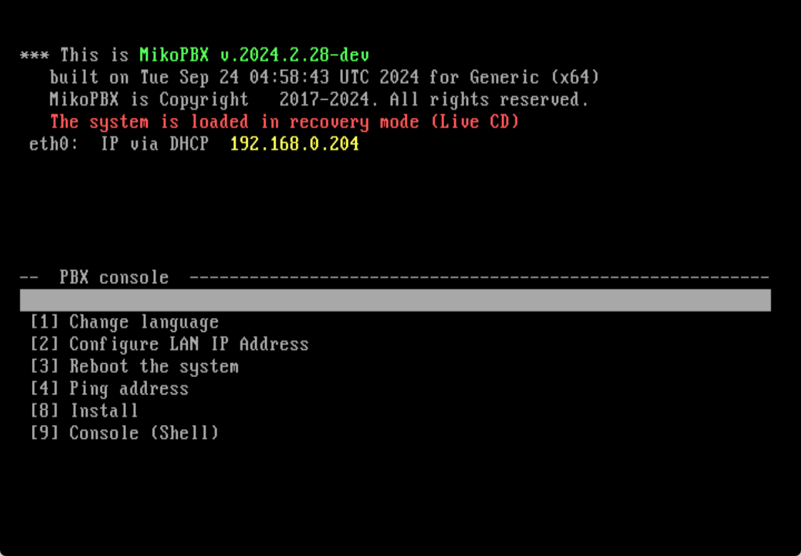
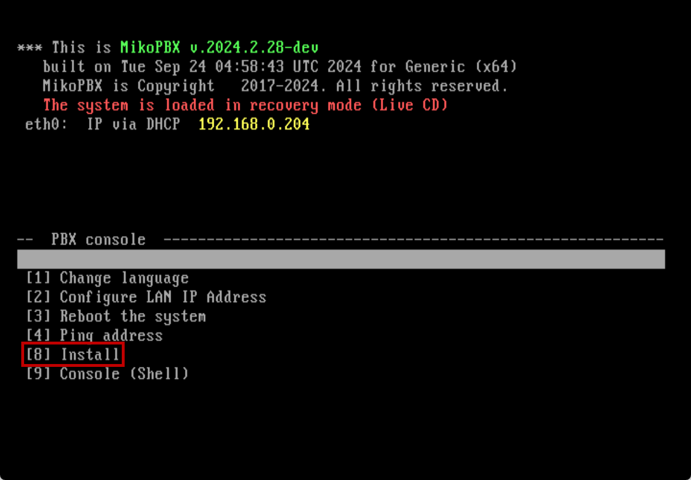
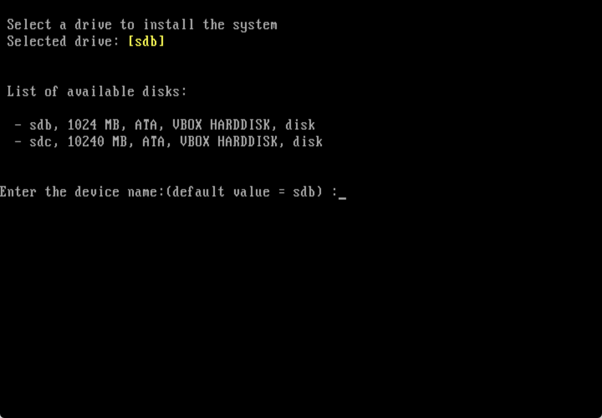
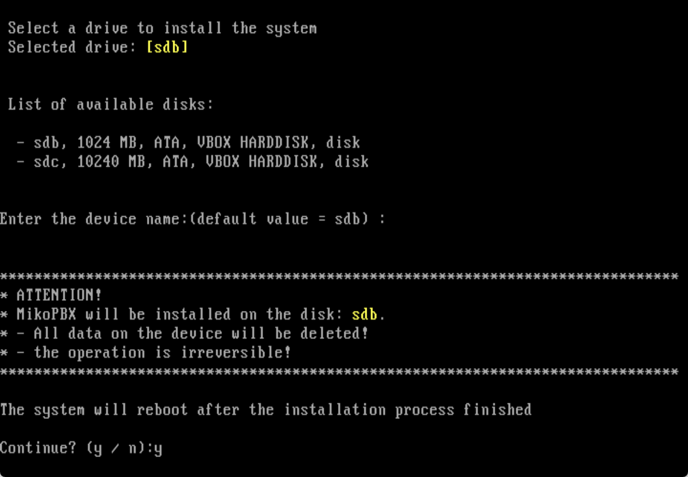
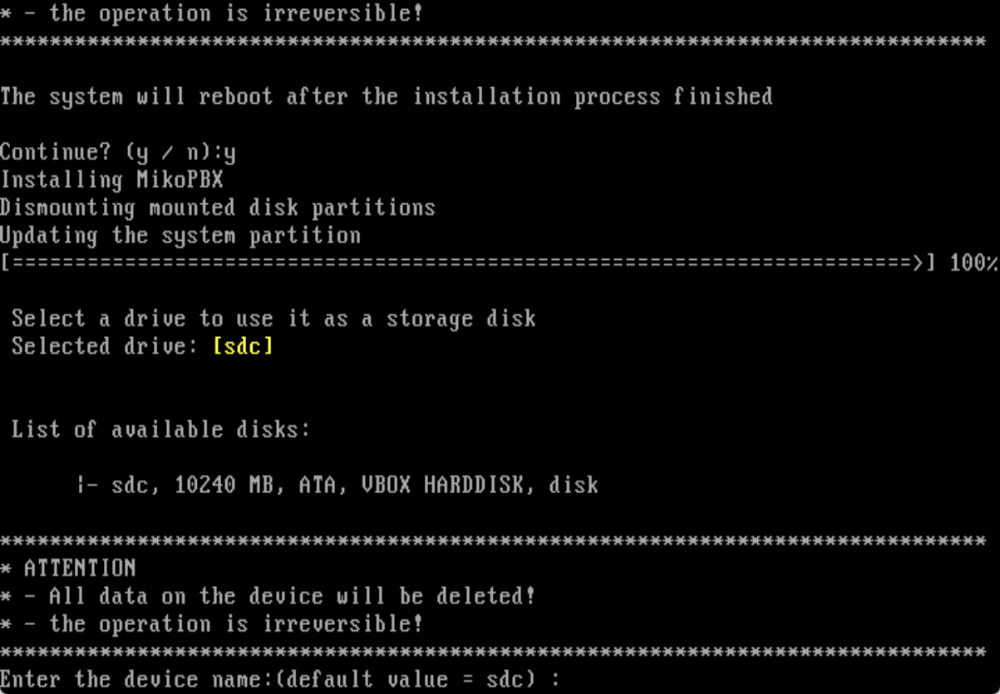
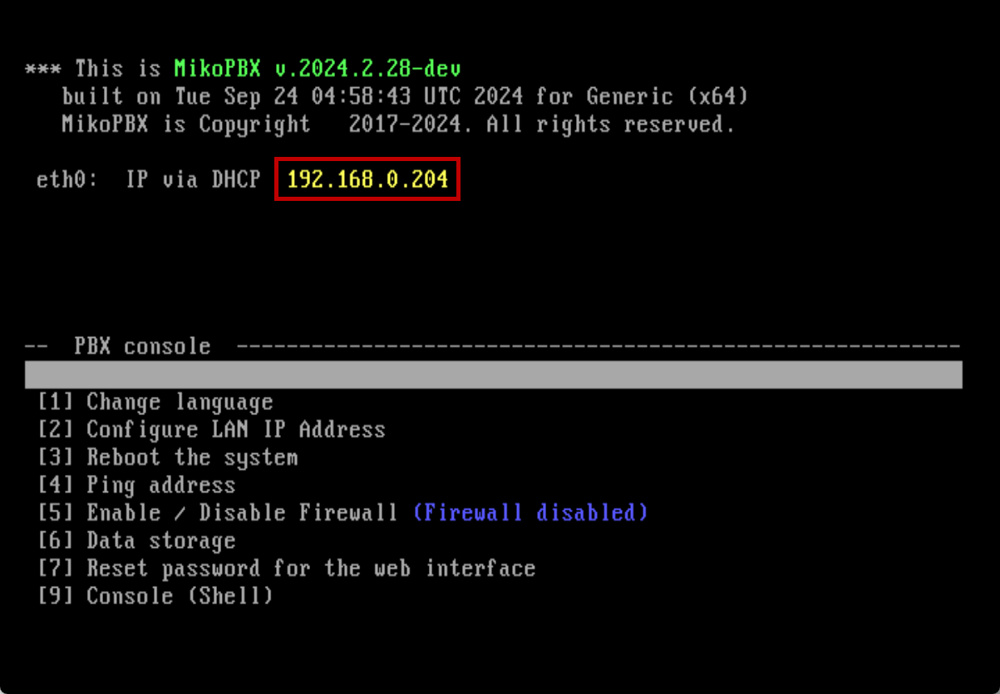
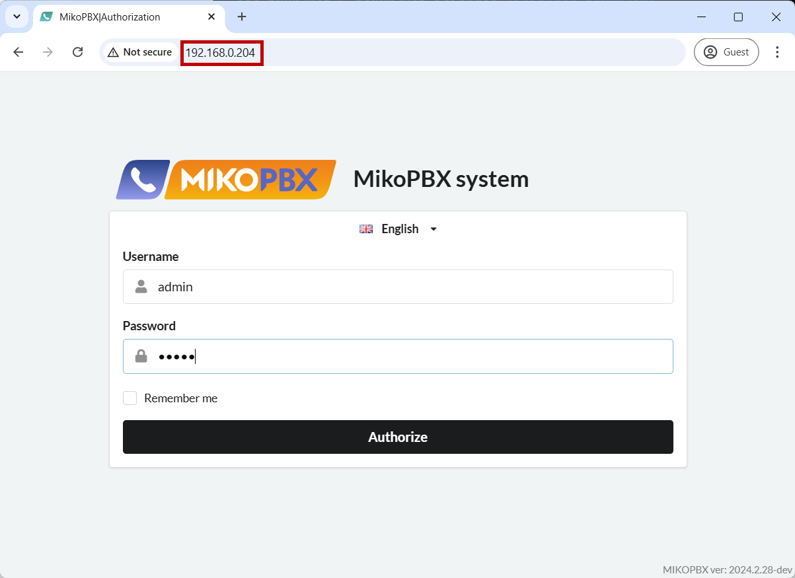

# VMware ESXi

## Creating a Virtual Machine

1. Start by creating a new virtual machine.
2. Enter the **Name**, **Type**, and **Version** of the virtual machine, as shown in the image below.

<figure><figcaption>
Name, Type and Version of the virtual machine
</figcaption></figure>

3. Select a datastore for the virtual machine.
4. Allocate **1024 MB** of memory to the virtual machine and create a **new** virtual hard disk for the system with a size of <mark style="color:green;">**1024**</mark>**&#x20;MB**.

<figure><figcaption>
Size of RAM and memory for the system hard drive
</figcaption></figure>

5. Choose the SCSI controller type and adapter type, as shown in the image below.

<figure><figcaption>
Controller type and adapter type
</figcaption></figure>

6. Select **BIOS** as the **Firmware** option.

<figure><figcaption>
"Boot options" section
</figcaption></figure>

7. Review and save the changes.

## Configuring the Virtual Machine

1. Open the settings of the created virtual machine. Create a new hard disk for storing call recordings.


We recommend allocating at least 50 GB for this disk.


2. Go to the CD/DVD Drive tab. Upload the ISO image for installation, and check the box next to "Connect at power on."

<figure><figcaption>
Loading a system image
</figcaption></figure>

## Installing MikoPBX

1. Start the virtual machine.
2. The MikoPBX command-line interface will open as the PBX starts loading from the optical disk containing the ISO image. You will see the message: "<mark style="color:red;">**The system is loaded in recovery mode (Live CD)**</mark>".

<figure><figcaption>
System is loaded in recovery mode 
</figcaption></figure>


Use the [arrow keys](https://en.wikipedia.org/wiki/Arrow_keys) to navigate the menu, and press **Enter** to select an option. You can also press the corresponding number on the [numpad](https://en.wikipedia.org/wiki/Computer_keyboard#Alphanumeric_keys).


3. Install MikoPBX:&#x20;


All data on the disk where MikoPBX is being installed will be lost.


Go to **\[8] Install:**

<figure><figcaption>
[8] Install - for installation process 
</figcaption></figure>

4. Information about all **available** disks will appear (in this example: **sdb**, **sdc**).

<figure><figcaption>
Available disks for the system
</figcaption></figure>

5. Enter the name of the disk you intended as the "system" disk, in this case, **sdb**, and press **Enter** (or simply press **Enter** if it’s already selected).
6. The system will prompt for confirmation. Type **y** and press **Enter:**

<figure><figcaption></figcaption></figure>

7. Once installation is complete, you will be prompted to select a disk for storing call recordings.


Approximately **14 MB** of storage is required for every **1 hour** of recorded conversation.


Enter the disk name (in this example, the only available disk is **sdc**) and press **Enter.**

<figure><figcaption>
Available disks for the storage
</figcaption></figure>

8. After installation, the system will reboot.

MikoPBX will now boot from **sdb**, the system disk, and the line **"**<mark style="color:red;">**The system is loaded in Recovery mode**</mark>**"** will no longer appear—indicating a successful installation.

This completes the MikoPBX installation.

## First Login to MikoPBX

To access the control panel, enter the virtual machine's IP address in your browser's address bar.

<figure><figcaption>
IP-Address of the MikoPBX
</figcaption></figure>

<figure><figcaption>
Web interface login window
</figcaption></figure>

The default login credentials are **admin** for both username and password.

This completes the MikoPBX installation.
