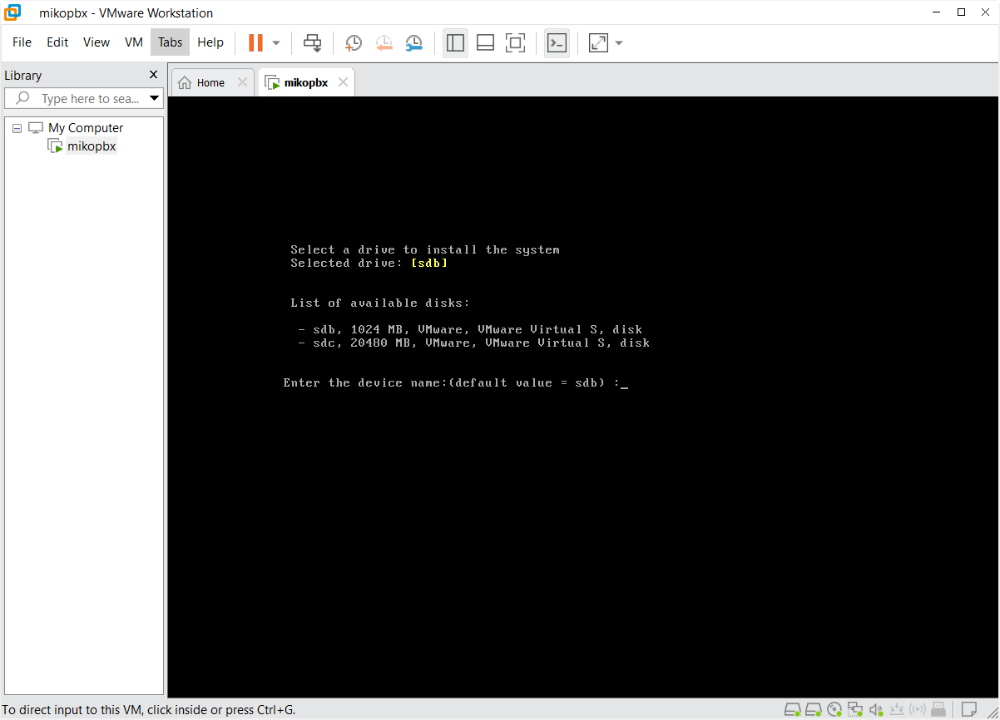
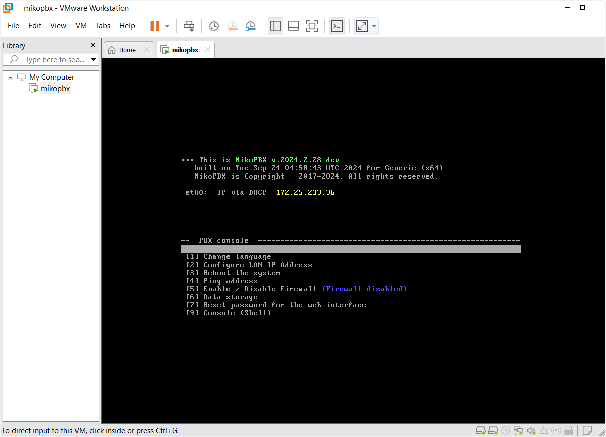
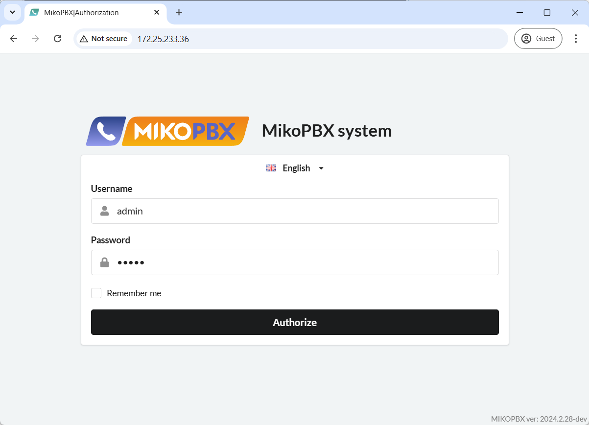

# VMware Workstation Pro

This guide covers creating and configuring a virtual machine in VMware Workstation Pro and installing MikoPBX on it.

You can download the VMware Workstation Pro installer from [the official website](https://www.vmware.com/).


Use versions of MikoPBX other than 2024.1.114 for installation on VMware Workstation Pro. Version 2024.1.114 currently does not support installation via VMware Workstation Pro!


## Creating a Virtual Machine

1. Open VMware Workstation Pro and click "**Create a New Virtual Machine**" to start creating a new virtual machine.

<figure><figcaption>
The "Create a New Virtual Machine" element
</figcaption></figure>

2. In the setup interface, select the virtual machine type: "**Typical (recommended)**". Then, click "**Next >**".

<figure><figcaption>
Selecting the type of virtual machine to create
</figcaption></figure>

3. Choose the installation source, "**Installer disc image file (iso):**". Select the .iso file you want to use. You can download the distribution from [this link](https://www.mikopbx.ru/download/). Click "**Next >**" to continue.

<figure><figcaption>
Selecting the system installation source for the virtual machine being created
</figcaption></figure>

4. Select "**Linux**" for the "**Guest operating system**" and "**Debian 11.x 64-bit**" as the version. Click "**Next >**".

<figure><figcaption>
Selecting an operating system and version for the virtual machine being created
</figcaption></figure>

5. Enter a desired name for the virtual machine in "**Virtual machine name:**" and, if necessary, specify a location on your computer under "**Location**". Click "**Next >**".

<figure><figcaption>
Specifying the name and path for the virtual machine being created
</figcaption></figure>

6. Set the size for the primary (**system**) hard drive, with a recommended size of **1GB**. Choose "**Split virtual disk into multiple files**" and click "**Next >**".

<figure><figcaption>
Specifying parameters for the system hard disk for the virtual machine being created
</figcaption></figure>

7. A summary of the virtual machine configuration will appear. Click "**Finish**" to create the virtual machine.

<figure><figcaption>
The final configuration of the machine being created.
</figcaption></figure>

### Adding and Connecting a Second Disk

Now, let's create and attach a second hard drive, which will be used to store call recordings.

1. Open the settings of the previously created virtual machine.

<figure><figcaption>
Virtual Machine Settings Section
</figcaption></figure>

2. Click "Add..." to add a new system component.

<figure><figcaption>
Button for adding a new system element
</figcaption></figure>

3. In **Hardware types**, select "**Hard Disk**" and click "**Next >**".

<figure><figcaption>
Selecting the type of a new system element
</figcaption></figure>

4. Choose "**Virtual disk type**" - "**SCSI**". Click "**Next >**".

<figure><figcaption>
Selecting a disk type
</figcaption></figure>

5. Choose "**Create a new virtual disk**" and click "**Next >**".

<figure><figcaption>
Selecting the "Create a new virtual disk" option
</figcaption></figure>

6. Specify the disk size, with a recommended minimum of **50GB**. Also, choose "**Split virtual disk into multiple files**". Click "**Next >**".

<figure><figcaption>
Specifying parameters for the disk being created
</figcaption></figure>

7. Give the hard drive a custom name and click "**Finish**".

<figure><figcaption>
Name for the second hard drive
</figcaption></figure>

### Configuring the Network Interface for the Virtual Machine

In the settings, go to "**Network Adapter**" and select "**Network connection**" - "**Bridged: Connected directly to the physical network**". Click "**OK**".

<figure><figcaption>
Setting up a network interface
</figcaption></figure>

## First System Boot

1. Start the virtual machine.

<figure><figcaption>
Button to start the virtual machine
</figcaption></figure>

2. The MikoPBX command-line interface will open as the PBX starts loading from the optical disk where the ISO image was mounted. This is indicated by the line: "<mark style="color:red;">**The system is loaded in Recovery mode**</mark>":

<figure><figcaption>
Loaded MikoPBX from optical disk
</figcaption></figure>


Use the [arrow keys](https://en.wikipedia.org/wiki/Arrow\_keys) to navigate through the menu options.\
Press **Enter** to select an option, or press the corresponding number on the [numpad](https://en.wikipedia.org/wiki/Computer\_keyboard#Alphanumeric\_keys).


3. To install MikoPBX, select "**\[8] Install**".
4. A list of **available** disks will be displayed (in this example, **sdb**, **sdc**). The system suggests a default disk, **sdb** in our case, for the installation. If you agree with the suggested disk for the system, press Enter. Otherwise, enter the name of another disk.


All data on the selected installation disk will be erased.


<figure><figcaption>
Selecting a disk for the system
</figcaption></figure>

5. The system will issue a warning. To confirm the operation, enter "**y**" and press Enter.
6. After installation, you'll be prompted to select a disk for storing call recordings. Enter the disk name (in this example, **sdc**) and press **Enter**.

<figure><figcaption>
Selecting a disk for storing call recordings
</figcaption></figure>

7. After installation, the system will restart. MikoPBX will now boot from **sdb**, the installation disk, without the line **"**<mark style="color:red;">**The system is loaded in Recovery mode**</mark>**"**—indicating a successful installation.

<figure><figcaption>
MikoPBX successfully installed
</figcaption></figure>

## First Login to MikoPBX

To access the MikoPBX web interface, enter your virtual machine's IP address in your browser's address bar. You can find the IP address in the console.

<figure><figcaption>
MikoPBX IP address
</figcaption></figure>

Enter the IP address in your browser’s address bar. Log in using the default credentials.


Use the following default credentials for the first login to the MikoPBX web interface:

* Username: admin
* Password: admin


<figure><figcaption>
MikoPBX WEB interface authorization page
</figcaption></figure>
