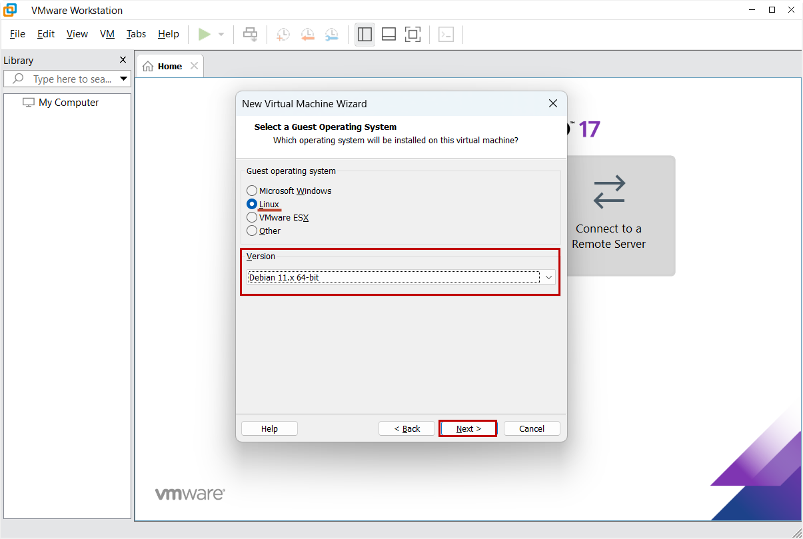

# VMware Workstation Pro

В текущей инструкции будет описан процесс создания и настройки виртуальной машины в VMware Workstation Pro, а так же процесс установки MikoPBX.&#x20;

Скачать установщик VMware Workstation Pro можно [на сайте](https://www.vmware.com/).


Используйте для установки на VMware Workstation Pro версии АТС MikoPBX отличные от 2024.1.114

Версия 2024.1.114 временно не поддерживает установку с помощью VMware Workstation Pro!


## Создание виртуальной машины

1. Перейдите в интерфейс VMware WorkStation Pro. Нажмите кнопку "**Create a New Virtual Machine**" для создания новой виртуальной машины.

<figure><figcaption>
Элемент "Create a New Virtual Machine"
</figcaption></figure>

2. В интерфейсе создания виртуальной машины укажите тип виртуальной машины: "**Typical (recommended)**". Далее, нажмите - "**Next >**".

<figure><figcaption>
Выбор типа создаваемой виртуальной машины
</figcaption></figure>

3. Далее выберите источник установки "**Installer disc image file (iso)**:", выберите файл образа диска с расширением .iso. Скачать дистрибутив вы можете по [ссылке](https://www.mikopbx.ru/download/). После выбора нажмите "**Next >**" для продолжения.

<figure><figcaption>
Выбор источника установки системы для создаваемой виртуальной машины
</figcaption></figure>

4. Выберите "**Linux**" в поле "**Guest operating system**". В качестве "**Version**" - "**Debian 11.x 64-bit**". Нажмите "**Next >**"

<figure><figcaption>
Выбор операционной системы и версии для создаваемой виртуальной машины
</figcaption></figure>

5. Укажите желаемое имя для виртуальной машины в поле "**Virtual machine name:**". Так же есть возможность указать локацию для этой виртуальной машины на вашем компьютере: используйте поле "**Location**". Нажмите "**Next >**".

<figure><figcaption>
Указание названия и пути для создаваемой виртуальной машины
</figcaption></figure>

6. Укажите размер для первого (**системного**) жесткого диска: рекомендуемое значение - **1Гб**. Выберите "**Split virtual disk into multiple files**". Нажмите "**Next >**".

<figure><figcaption>
Указание параметров для системного жесткого диска для создаваемой виртуальной машины
</figcaption></figure>

7. Отобразится итоговая конфигурация виртуальной машины. Нажмите "**Finish**". Произойдет создание виртуальной машины.

<figure><figcaption>
Итоговая конфигурация создаваемой машины.
</figcaption></figure>

## Создание и подключение второго диска

Далее мы создадим и подключим второй жесткий диск, который будет использоваться для хранения записей разговоров.

1. Перейдите в настройки раннее созданной виртуальной машины.

<figure><figcaption>
Раздел настроек виртуальной машины
</figcaption></figure>

2. Нажмите "Add..." для добавления нового элемента системы.

<figure><figcaption>
Кнопка для добавления нового элемента системы
</figcaption></figure>

3. Выберите "**Hard Disk**" в разделе "**Hardware types**". Нажмите "**Next >**"

<figure><figcaption>
Выбор типа нового элемента системы
</figcaption></figure>

4. Выберите "**Virtual disk type**" - "**SCSI**". Нажмите "**Next >**".&#x20;

<figure><figcaption>
Выбор типа диска
</figcaption></figure>

5. Выберите "**Create a new virtual disk**". Нажмите "**Next >**".

<figure><figcaption>
Выбор параметра "Create a new virtual disk"
</figcaption></figure>

6. Выберите размер диска: рекомендованное значение - не менее **50 Гб**. Так же выберите параметр "**Split virtual disk into multiple files**". Нажмите "**Next >**"

<figure><figcaption>
Указание параметров для создаваемого диска
</figcaption></figure>

7. Укажите произвольное название для жесткого диска. Нажмите "**Finish**"

<figure><figcaption>
Название для второго жесткого диска
</figcaption></figure>

## Указание сетевого интерфейса для виртуальной машины

В настройках перейдите в раздел "**Network Adapter**". Выберите "**Network connection**" - "**Bridged**: **Connected directly to the physical network**". Нажмите "**OK**"

<figure><figcaption>
Настройка сетевого интерфейса
</figcaption></figure>

## Первый запуск системы

1. Произведите запуск виртуальной машины.

<figure><figcaption>
Кнопка для запуска виртуальной машины
</figcaption></figure>

2. Откроется командный интерфейс MikoPBX. АТС начнет загружаться. На данном этапе MikoPBX загружается с оптического диска, на который записан ISO-образ. На это нам указывает строчка: "<mark style="color:red;">**The system is loaded in Recovery mode**</mark>".

<figure><figcaption>
Загруженная MikoPBX с оптического диска
</figcaption></figure>


Перемещаться по пунктам меню можно [клавишами управления курсором](https://ru.wikipedia.org/wiki/%D0%9A%D0%BB%D0%B0%D0%B2%D0%B8%D1%88%D0%B8\_%D1%83%D0%BF%D1%80%D0%B0%D0%B2%D0%BB%D0%B5%D0%BD%D0%B8%D1%8F\_%D0%BA%D1%83%D1%80%D1%81%D0%BE%D1%80%D0%BE%D0%BC).

Выбрать пункт меню - клавиша **Enter**.

Также можно выбирать пункт меню нажав на [буквенно-цифровом блоке клавиатуры](https://ru.wikipedia.org/wiki/%D0%9A%D0%BE%D0%BC%D0%BF%D1%8C%D1%8E%D1%82%D0%B5%D1%80%D0%BD%D0%B0%D1%8F\_%D0%BA%D0%BB%D0%B0%D0%B2%D0%B8%D0%B0%D1%82%D1%83%D1%80%D0%B0#%D0%91%D1%83%D0%BA%D0%B2%D0%B5%D0%BD%D0%BD%D0%BE-%D1%86%D0%B8%D1%84%D1%80%D0%BE%D0%B2%D0%BE%D0%B9\_%D0%B1%D0%BB%D0%BE%D0%BA) соответствующую пункту цифру.


3. Переключите язык интерфейса на русский. Для этого выполните **"\[1] Change Language"** -> **"\[2] Русский"**.&#x20;
4. Далее произведем установку MikoPBX. Перейдите в пункт "**\[8] Install**".
5. Отобразится информация о всех **доступных** дисках (в данном примере: **sdb**, **sdc**). Системой предложен диск по умолчанию, в нашем случае - sdb. Если вы согласны с предложенным диском, который будет использоваться в качестве системного - нажмите Enter. В противном случае напишите название другого диска.


Все данные на диске, куда устанавливается MikoPBX, будут потеряны.


<figure><figcaption>
Выбор диска для системы
</figcaption></figure>

6. Далее система выдаст предупреждения.  Для подтверждение операции - введите "**y**" и нажмите Enter.
7. После выполнения установки будет предложено выбрать диск для хранения записей разговоров. Введите имя диска (в данном примере - единственный доступный диск **sdc**) и нажмите **Enter.**

<figure><figcaption>
Выбор диска для хранения записей разговоров
</figcaption></figure>

8.  После завершения установки система перезагрузится.

    Теперь MikoPBX будет запускаться с диска **sdb**, на который вы ее установили. Увидим, что строчка «<mark style="color:red;">**The system is loaded in Recovery mode**</mark>» отсутствует. Это значит, что установка MikoPBX совершена успешно.

<figure><figcaption>
Успешно установленная MikoPBX
</figcaption></figure>

## Первый вход в MikoPBX

Для того, чтобы открыть веб-интерфейс MikoPBX вам надо вписать в строку браузера IP-адрес вашей виртуальной машины, найти его вы можете в консоли.

<figure><figcaption>
IP-адрес MikoPBX
</figcaption></figure>

Впишите IP-адрес в адресную строку вашего браузера. Произведите первый вход в MikoPBX по стандартному логину и паролю.


При первом входе в WEB-интерфейс MikoPBX используйте стандартные данные:

* Логин: admin
* Пароль: admin


<figure><figcaption>
Страница авторизации в WEB-интерфейс MikoPBX
</figcaption></figure>
